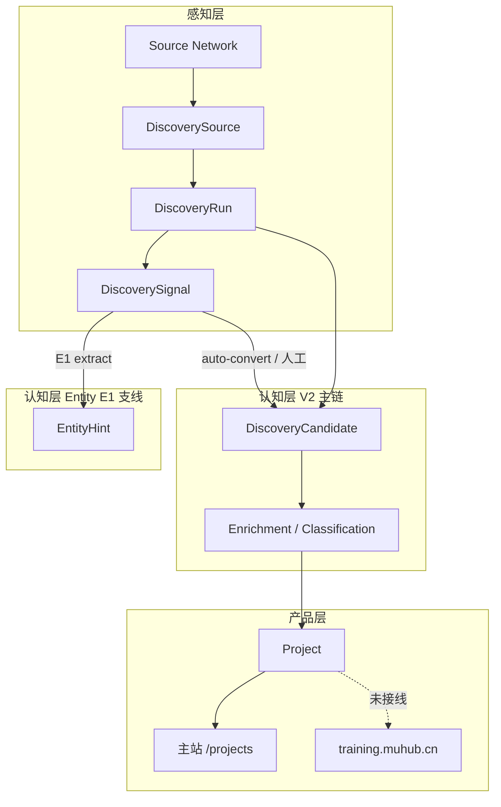

# MUHUB 阶段性架构审视

> **文档类型**：架构审视（只读，不含代码变更）  
> **日期**：2026-05-28  
> **审视范围**：主站 Project、Discovery V2、Source Network、publishing_ai、Entity Discovery E1、training、Admin、Prisma、scripts/cron、feature flags、AI 接入  
> **背景**：Entity Discovery E1 已落地；在启动 E2 前对全栈做一次边界与债务盘点

---

## 执行摘要

MUHUB 当前仍具备 **可理解的宏观分层**（感知 → 认知 → 产品），但 **Discovery 子系统内部已出现三层并行对象**（Signal / Candidate / EntityHint）与 **V1/V2 双轨遗留**，运营与开发认知成本正在上升。

| 维度 | 结论（一句话） |
|------|----------------|
| 宏观架构清晰度 | **中等偏上** — Project 仍是唯一产品核心，Discovery 是能力层 |
| Discovery 三层边界 | **文档清晰、运行时部分重叠** — Source Network 薄、V2 主链、Entity E1 支线未闭环 |
| 概念重叠 | **存在** — 同一 RSS 条目可产生 Signal、Candidate、EntityHint |
| training | **仍是 thin consumer** — 静态卡片 + 本地 JSON，未接 Project DB |
| Admin | **开始分散** — layout 顶栏 vs discovery hub vs 首页三套导航 |
| Prisma | **有膨胀风险** — Project/DiscoveryCandidate JSON 与 AI 状态列密集 |
| scripts | **开始堆积** — ~42 个 TS 脚本，demo/acceptance/生产混放 |
| 是否进 E2 | **暂缓 2～3 周** — 先补 Source 质量、E1 抽检、Admin/flags 治理 |

---

## 一、审视方法与系统地图

### 1.1 当前分层（理想 vs 现实）



**理想**：Source Network 管源 → Signal 是原始线索 → Entity Discovery 识别实体 → 高置信晋升为 Candidate/Project。  
**现实**：GitHub/PH 仍 **直写 Candidate**；RSS 走 **Signal →（可选）Candidate**；EntityHint **独立支线、默认关闭、无晋升闭环**。

### 1.2 规模速查（2026-05-28）

| 区域 | 规模 |
|------|------|
| Prisma models | **29** |
| Prisma enums | **25** |
| Json? 字段 | **34** |
| `lib/discovery/` | ~94 文件 |
| `lib/project*` + `projects/` | ~55 文件 |
| Admin `page.tsx` | **28** 路由 |
| Admin API routes | **29** |
| `scripts/*.ts` | **42** |
| Cron HTTP 路由 | **5**（daily-discovery、ai-update、source-update、summary-update、track-official-info） |

---

## 二、分域审视

### 2.1 主站 Project 系统

**职责**：MUHUB 唯一对外「项目公众主页」产品对象；广场列表、详情、认领、AI  enrichment 均围绕 `Project`。

**关键路径**：

| 层 | 路径 |
|----|------|
| 数据 | `prisma/schema.prisma` → `Project` 及 10+ 关联表 |
| 列表/详情 | `lib/project-list.ts`、`lib/load-project-page-view.ts`、`app/projects/` |
| Discovery 导入 | `lib/discovery/import-candidate.ts`、`lib/sync-discovery-to-project.ts` |
| AI | `lib/project-ai-insight.ts`、`lib/ai/enrich-project.ts` |

**清晰度**：**高** — 「Project 是核心」在文档与 schema 注释中一致。

**风险信号**：

- `isPublic` 与 `visibilityStatus` 双轨（历史兼容）
- `ProjectSource` 与 `ProjectExternalLink` 导入时双写
- `lib/project*.ts` 与 `lib/projects/` 目录命名分裂
- `Project` 上 **20+ AI 相关列 + 14 个 Json 字段**，认知与迁移成本高

**评价**：产品层稳定；技术债主要在 **AI 字段族膨胀** 与 **来源模型双轨**，不影响当前发布，但影响长期演进。

---

### 2.2 Discovery V2

**职责**：可配置 Source → Run → Candidate（+ Signal 分支）→ 审核 → Import → Project。

**主链路**（文档与代码一致）：

```
DiscoverySource → DiscoveryRun → DiscoveryCandidate
                              ↘ DiscoverySignal (RSS/NEWS)
```

**入口**：

| 类型 | 路径 |
|------|------|
| 运行总线 | `lib/discovery/run-discovery-source.ts` |
| 日工作流 | `lib/discovery/daily-discovery-workflow.ts` |
| Cron | `GET /api/cron/daily-discovery` |
| Admin | `/admin/discovery`、`POST /api/admin/discovery/run` |
| 导入 | `lib/discovery/import-candidate.ts` |

**清晰度**：**中高** — V2 主链有 `docs/discovery/discovery-architecture.md`；但 `agents/discovery/` 与 `lib/discovery/` 并存，V1 `DiscoveredProjectCandidate` 与 `/api/internal/discovery` 仍存活。

**风险信号**：

- `run-discovery-source.ts` **700+ 行** 多 type/subtype 分支
- `DiscoveryCandidate` **10 个 Json 字段**
- publishing 自动 `autoConvertHighConfidencePublishingSignals` 与 Entity E1 抽取 **无协调**

**评价**：仍是平台核心能力，运行稳定；需要 **收敛遗留 V1** 与 **拆分巨型 run 文件**（P1，非阻塞）。

---

### 2.3 Source Network

**职责**：DiscoverySource 的 **运营 CRUD + 产出统计**；不是独立子系统或独立表。

**实现**：

| 文件 | 职责 |
|------|------|
| `lib/discovery/source-network/source-crud.ts` | 创建/更新 Source |
| `lib/discovery/source-network/source-kinds.ts` | RSS/GITHUB_TOPIC/WEBSITE/WECHAT |
| `lib/discovery/source-network/source-yield.ts` | signalCount、candidateCount、lastRun |
| Admin | `/admin/discovery/sources` |

**清晰度**：**高** — 薄层、职责单一；与 V2 共享 `DiscoverySource` 表是正确设计。

**缺口**：yield 统计 **尚未包含 EntityHint 计数**；`sourceAuthorityTier` 等 Entity 相关 config 未在 Source 表单一等公民化。

**评价**：边界清楚；继续作为 **感知层运营入口** 扩展即可，不必单独建表。

---

### 2.4 publishing_ai Vertical Discovery

**职责**：在通用 Discovery 上叠加 **行业 scope 语义**（seed sources、过滤、展示入口）。

**实现**：

| 机制 | 路径 |
|------|------|
| Scope 常量 | `lib/discovery/discovery-scopes.ts` |
| Source/Candidate/Project 标注 | `configJson.scopes`、`discoveryScopes` |
| Pipeline | `lib/discovery/publishing/publishing-discovery-pipeline.ts` |
| 过滤 | `publishing-content-filter.ts`、`github-publishing-relevance-filter.ts` |
| Seeds | `scripts/seed-publishing-sources.ts` |

**清晰度**：**中等** — scope 驱动逻辑清晰；`configJson.industry` 遗留字段仍通过 `scopesFromLegacyIndustry` 兼容。

**与 training 关系**：**未打通** — `TRAINING_PROJECTS_MODE=live` 在 feature flags 中定义，**app 内零引用**；training 项目页仍为硬编码卡片。

**评价**：Vertical 语义已进 DB；**消费端（training）滞后** 是已知缺口，不应与 Entity E2 并行抢资源。

---

### 2.5 Entity Discovery E1

**职责**：从 Signal 抽取 **EntityHint**（机构/实验室/项目名等线索），不要求完整 Project 字段。

**实现**：

| 组件 | 状态 |
|------|------|
| `EntityHint` 表 | 已 migration |
| 抽取 | `lib/discovery/entity/extract-from-signal.ts`（规则 + 可选 AI） |
| 持久化 | `lib/discovery/entity/persist-hints.ts` |
| Admin | `/admin/discovery/entities` |
| Flags | `ENTITY_DISCOVERY_ENABLED`、`ENTITY_HINT_EXTRACTION_ENABLED`（**默认 false**） |
| 流水线挂钩 | **无** — 不随 Signal 创建自动触发 |

**清晰度**：**设计文档完整**（`docs/discovery/entity-discovery-architecture.md`）；**运行时与主链隔离**，团队需明确「E1 是实验支线」。

**E1 实测问题**（2026-05-28）：

- 当前 publishing_ai Signal 多为 **英文 RSS**；规则抽取产生 `News Summary` 类噪声
- 库内符合 scope 的 Signal 仅 ~10 条；**中文权威名单/公告源不足**

**评价**：E1 **技术落地正确**；**数据与源质量**未达 E2 前置条件。

---

### 2.6 training.muhub.cn

**职责**：出版实训 **子域入口** — 报名、作业、静态项目研究卡片、案例。

**实现**：

| 项 | 现状 |
|----|------|
| 路由 | `middleware.ts` rewrite → `/training/**` |
| 项目页 | `app/training/projects/page.tsx` — **硬编码 `PROJECTS[]`** |
| 数据 | `data/training-registrations.json`、`data/training-homework.json` |
| PWA | 子域专用 manifest / SW |

**是否为 thin consumer？** **是。**

- 不读 Prisma Project
- 不写 Discovery
- `TRAINING_PROJECTS_MODE=live` 未实现
- 外链至主站 `/projects?category=publishing_media`

**评价**：符合 V1 边界文档；**不应**在 Entity E2 阶段同时大改 training 数据层。

---

### 2.7 Admin 后台

**页面规模**：28 个 `page.tsx`；Discovery 子树占 **15+** 路由。

**导航体系（三套）**：

| 体系 | 覆盖 | 缺失 |
|------|------|------|
| **`layout.tsx` 顶栏** | 候选列表、JSON 队列、来源、任务、项目、营销、系统 | signals、entities、daily、mobile、ai-pipeline |
| **`/admin/discovery` 页内 hub** | 完整 Discovery 二级链（含 Signals、Entity Hints） | 非 discovery 工作流 |
| **`/admin` 首页** | 3 卡片（discovery/projects/marketing） | 系统后台、signals、entities |

**默认 callback**：`/admin/projects`（layout），与「Discovery-first 试运营流程」文案可能不一致。

**是否入口混乱？** **轻度混乱，尚未失控。**

- 熟手从 `/admin/discovery` hub 进入可覆盖全链路
- 新人从顶栏或首页 **找不到** Signals / Entity Hints / Daily
- Signal 详情同时有「转为候选项目」与「抽取 Entity Hint」— **语义并存但缺引导**

**评价**：P1 — 需要 **统一 Discovery 二级导航**（文档或 layout 补链），不必大改 IA。

---

### 2.8 Prisma 数据模型

**模型分布**：

| 域 | Models |
|----|--------|
| Auth | User, Account, Session, VerificationToken, PhoneVerificationCode |
| Discovery V2 | DiscoverySource, Run, Candidate, Signal, Enrichment*, Classification*, EntityHint |
| Discovery V1 遗留 | DiscoveredProjectCandidate |
| Project 生态 | Project + 12 关联表 |
| 通知/互动 | ProjectLike, Follow, UserNotification, … |

**Json 密集区**：

- `DiscoveryCandidate`：10× Json
- `Project`：14× Json + 大量 `*Status`/`*UpdatedAt`/`*Error` 三元组
- `EntityHint`：discoveryScopes、evidenceJson

**字段膨胀风险？** **是，尤其 Project 与 DiscoveryCandidate。**

- 短期：additive migration 仍可行
- 中期：缺 runtime schema 校验，Json 演化易出现 **读写不一致**
- 不建议再为每个 AI 能力加独立 `*Status` 列；新能力应进 **单一 job/ops 表或 Json 包**

**评价**：未到必须拆库程度；需 **纪律** — 新字段必须证明无法放入现有 Json/ops 表。

---

### 2.9 scripts / cron / pipeline

**Cron 路由**：

| 路由 | 职责 |
|------|------|
| `/api/cron/daily-discovery` | Discovery 日工作流 |
| `/api/cron/ai-update` | Project AI 批处理 |
| `/api/cron/source-update` | 信息源更新 |
| `/api/cron/summary-update` | 周摘要 |
| `/api/cron/track-official-info` | 官网追踪 |

**`scripts/cron_all.ts`**：串联 ai → source → summary → tracker；**不含 daily-discovery** — 运维需单独调度 discovery cron。

**scripts 分类（42 个 TS）**：

| 类别 | 约数量 | 示例 |
|------|--------|------|
| Discovery 生产 | ~10 | `run-daily-discovery.ts`、`run-publishing-discovery.ts` |
| Entity E1 | 2 | `extract-entity-hints.ts`、`acceptance-entity-discovery-e1.ts` |
| Publishing seed/backfill | ~8 | `seed-publishing-sources.ts`、`backfill-discovery-scopes.ts` |
| Acceptance | ~4 | `acceptance-publishing-discovery-*.ts` |
| Legacy V1 | 1+ | `run-project-discovery.ts` |
| Demo / content / growth | ~10 | `run-content-*-demo.ts`、`run-launch-demo.ts` |
| Ops | ~5 | `run_ai_update.ts`、`source_update.ts` |

**是否堆积？** **是，但可控。**

- 生产与 demo 同目录，新人难辨
- GitHub discovery 有 v3/batch/demo 多个变体
- 缺 `scripts/README.md` 索引

**评价**：P2 整理；P1 明确 **哪些脚本是生产 cron 契约**。

---

### 2.10 feature flags / rollback

**Discovery 相关 flags**（`lib/discovery/discovery-feature-flags.ts`）：

| Flag | 默认 | 作用 |
|------|------|------|
| `VERTICAL_DISCOVERY_ENABLED` | true | Vertical scope 总开关 |
| `VERTICAL_DISCOVERY_RSS_ENABLED` | true | RSS 接入 run 总线 |
| `VERTICAL_DISCOVERY_PUBLISHING_PIPELINE` | true | publishing 批量 pipeline |
| `VERTICAL_DISCOVERY_PUBLISHING_RSS_FILTER` | true | RSS 关键词过滤 |
| `TRAINING_PROJECTS_MODE` | static | **未接线** |
| `ENTITY_DISCOVERY_ENABLED` | **false** | Entity 总开关 |
| `ENTITY_HINT_EXTRACTION_ENABLED` | **false** | Hint 抽取 |

**`.env.example` 覆盖**：Vertical + Training **有注释**；**Entity flags 缺失** — 运维易遗漏。

**Rollback 能力**：

| 能力 | 评价 |
|------|------|
| Entity E1 | **好** — 关 flag 即零影响 |
| Vertical RSS | **好** — 可独立关闭 |
| V2 主链 | **差** — Vertical 默认全开，关总开关影响面大 |
| DB migration | **好** — 近期均为 additive |

**评价**：flags 机制 **有效但文档不全**；Entity E1 是 rollback 设计范例。

---

### 2.11 AI 接入与模型使用

**配置入口**：`lib/ai/ai-config.ts` — 统一 `AI_*` + `DEEPSEEK_*` fallback。

**调用路径（双轨）**：

| 路径 | 用途 | 特点 |
|------|------|------|
| `lib/ai/generate-text.ts` | 通用文本/JSON 生成 | OpenAI 兼容 fetch |
| `lib/project-ai-insight.ts` | Project 认知卡 | **794 行**，DeepSeek 直连 + evidence |
| `lib/project-ai-content.ts` | 传播草稿 | 类似直连模式 |
| `lib/discovery/entity/extract-from-signal.ts` | EntityHint 抽取 | 可选走 generate-text |
| `lib/discovery/signal-ai-insight.ts` | Signal 层 AI | Discovery 专用 |

**问题**：

- **两套 LLM 调用风格**（抽象层 vs 业务文件内直连）
- 模型/env 分散：`AI_MODEL`、`DEEPSEEK_MODEL_INSIGHT`、`DEEPSEEK_MODEL_CONTENT`
- 缺统一的 **prompt 版本 / ops 日志** 跨 Discovery 与 Project

**评价**：P1 — 新 AI 能力 **必须** 走 `generate-text` 或统一 wrapper；禁止再复制第四套直连。

---

## 三、核心问题回答

### 3.1 当前架构是否仍然清晰？

**宏观清晰，中观变糊。**

- **清晰**：Project = 产品核心；Discovery = 能力层；training = 薄入口
- **变糊**：Discovery 内部 Signal / Candidate / EntityHint 三线并行；V1/V2 双轨；Admin 三套导航

### 3.2 Discovery V2 / Source Network / Entity Discovery 边界是否清楚？

| 层 | 边界 |
|----|------|
| **Source Network** | 清楚 — Source CRUD + yield，不碰实体语义 |
| **Discovery V2** | 清楚 — Candidate 为中心的主链（含 Signal 分支） |
| **Entity Discovery** | 文档清楚、**运行时未汇入主链** — E1 是 Signal 侧支线 |

**建议口头定义**（团队共识）：

> Source Network 管「从哪感知」；Discovery V2 管「是否像 Project 并导入」；Entity Discovery 管「感知到的命名实体是什么」。

### 3.3 EntityHint / DiscoverySignal / DiscoveryCandidate 是否概念重叠？

**有重叠，但层级不同：**

| 对象 | 粒度 | 典型来源 | 下游 |
|------|------|----------|------|
| **DiscoverySignal** | 1 篇文章/条目 | RSS、新闻 | → Candidate；→ EntityHint |
| **DiscoveryCandidate** | 1 个类 Project 记录 | GitHub、PH、Signal convert | → Project |
| **EntityHint** | 1 个命名实体 | Signal extract | 暂无（E2+ Candidate） |

**重叠场景**：同一 RSS URL → 1 Signal → auto-convert 1 Candidate + extract N EntityHints。  
**风险**：运营在三个队列看到同一来源的多种表达，**缺统一「来源条目视图」**。

**结论**：概念可共存，但 **必须** 在 E2 做 merge 策略与 Admin 来源视图，否则重叠会从「设计层」变成「运营灾难」。

### 3.4 training 是否仍是 thin consumer？

**是。** 静态卡片 + JSON 文件；与 Discovery/Project DB 无读写。  
`live` 模式是明确预留，**不应**在 Entity 阶段隐式假设 training 已消费 Verified Entity。

### 3.5 Admin 是否开始入口混乱？

**轻度混乱** — 15+ Discovery 路由，顶栏缺 signals/entities；discovery 页 hub 才是完整入口。  
**尚未** 到无法维护，但 **每新增一个 Discovery 子页都会加剧**（Entity E2 若再加 Candidate 队列需谨慎）。

### 3.6 Prisma 是否已有字段膨胀风险？

**是，Project 与 DiscoveryCandidate 为高风险区。**

- Project：AI 状态列过多，应收敛到 ops log + 少量 Json
- DiscoveryCandidate：10 Json 字段，可接受但需防继续增加
- EntityHint：E1 设计克制，**风险低**

### 3.7 scripts 是否开始堆积？

**是** — 42 个 TS，demo/acceptance/生产混放。  
**未到不可维护** — 但缺索引与分类目录。

### 3.8 哪些技术债需立即处理（P0）？

见第四节。

### 3.9 哪些可以暂缓（P2）？

见第四节。

---

## 四、风险清单（P0 / P1 / P2）

### P0 — 立即关注（阻塞质量或引发错误决策）

| # | 风险 | 影响 | 建议动作 |
|---|------|------|----------|
| P0-1 | **publishing_ai 中文权威 Source 不足** | Entity/Candidate 均依赖低质量英文 RSS；误判「Discovery 深度不够」 | 2 周内 seed ≥5 类中文源（协会名单、公告、实验室）；跑一轮 E1 人工抽检 |
| P0-2 | **Signal/Candidate/EntityHint 同源重复表达** | 运营在三处审核同一新闻，效率低、结论冲突 | 文档定义「Source 条目 canonical 视图」；E2 前禁止加第四条并行队列 |
| P0-3 | **Entity flags 未进 `.env.example`** | 部署/协作者不知 Entity E1 存在或如何开启 | 补 env 注释 + Admin 页脚说明（文档即可，不必改代码也可先写 runbook） |
| P0-4 | **E1 抽取质量未验证即进 E2** | EntityCandidate 合并垃圾 Hint，债务前移 | **暂缓 E2**；完成 ≥50 条 Hint 人工 ACCEPT/REJECT 统计 |

### P1 — 重要（1 个月内应处理）

| # | 风险 | 影响 | 建议动作 |
|---|------|------|----------|
| P1-1 | **Discovery V1 双轨**（`DiscoveredProjectCandidate`、`/api/internal/discovery`） | 脚本/数据分流，新人混淆 | 标记 deprecated；禁止新功能接入 V1 |
| P1-2 | **Admin 导航分裂** | signals/entities 难发现 | layout 顶栏「项目筛选」组增加 Signals、Entity Hints 链 |
| P1-3 | **Project AI 字段膨胀** | 迁移/查询/认知成本高 | 新 AI 能力进 Json 或 `ProjectAiOpsLog`；禁止新 `*Status` 列 |
| P1-4 | **LLM 双路径** | 维护、换模型、审计困难 | 新代码统一 `generate-text`；逐步收拢 insight 直连 |
| P1-5 | **`TRAINING_PROJECTS_MODE=live` 死代码** | 规划与实现脱节 | 要么实现 read-only Project 列表，要么文档标注「Q3+」 |
| P1-6 | **`cron_all` 不含 daily-discovery** | 运维漏跑 Discovery | runbook 明确两条 cron 线；或文档化 schedule |
| P1-7 | **`run-discovery-source.ts` 巨型文件** | 改 publishing/institution/rss 易互相影响 | 按 source type 拆 adapter 注册表（计划，非立即重构） |

### P2 — 可暂缓（有纪律地排期）

| # | 风险 | 建议 |
|---|------|------|
| P2-1 | scripts demo 与生产混目录 | 增 `scripts/README.md` 分类索引 |
| P2-2 | `lib/project*` vs `lib/projects/` 命名 | 新代码只进 `lib/projects/` |
| P2-3 | `ProjectSource` vs `ProjectExternalLink` 双轨 | 只读统一视图层，不急于删表 |
| P2-4 | Source Network yield 缺 EntityHint 统计 | E2 时一并加 |
| P2-5 | Json 字段无 runtime schema | 引入 zod 校验关键 Json（import/export 路径优先） |
| P2-6 | GitHub discovery 多脚本变体 | 归档 demo，保留 1 个生产入口 |

---

## 五、建议动作（按优先级）

### 5.1 未来 2 周（审视期，不写 E2 代码）

1. **Source 质量冲刺**：seed 新闻出版署/协会/实验室类中文 Source；Institution adapter 走 Signal 或 Entity 路径（按 scope 配置）
2. **E1 抽检**：对现有 13+ Hint 做 ACCEPT/REJECT；记录误报类型（英文 RSS 噪声规则）
3. **Runbook**：`docs/operations/discovery-runbook.md`（可选）— cron、flags、脚本对照表
4. **`.env.example`**：补 `ENTITY_*` 注释（小改动，若审视期允许一笔 commit）
5. **团队共识文档**：Signal vs Candidate vs EntityHint 一页纸（可引用本文 §3.3）

### 5.2 未来 3～4 周（E2 前置）

1. 调整 `extract-from-signal.ts` 规则（英文 RSS 过滤、名单类中文增强）
2. Admin layout 补 Signals / Entity Hints 导航
3. 定义 EntityCandidate schema **草案**（仍 Json-heavy），评审后再 migration
4. training `live` 模式 **只读** 最小 POC（读 `discoveryScopes` 含 publishing_ai 的 Project）— 与 E2 **二选一** 优先

### 5.3 明确不做（审视期红线）

- 不删 V1 表/路由（仅 freeze）
- 不做知识图谱 / 公开 Entity 页
- 不并行开发 E2 + training live + Admin 大改版
- 不为 Entity 单独建复杂关系表（E2 仍 Json-first）

---

## 六、未来一个月开发纪律（红线）

以下纪律 **所有 PR 必须自检**：

### 6.1 架构红线

1. **Project 仍是唯一产品核心** — 新实体类型不得绕过 Project 直接上主站广场（Entity → Promotion → Candidate → Project）
2. **Additive only** — 不删除 Discovery V2 路径；新能力用 flag + scope 隔离
3. **不增第四条并行审核队列** — E2 的 EntityCandidate 必须能解释与 Signal/Candidate 的关系
4. **training 保持 thin** — 除非单独立项「training live POC」，否则不改 training 数据层
5. **Source 优先于算法** — 没有高质量 Source 不扩大 AI 抽取/merge 复杂度

### 6.2 数据红线

6. **Prisma 新列需 justification** — 能 Json 则不新列；能 ops log 则不新 Status 三元组
7. **Migration 必须可回滚** — additive；禁止 destructive 除非单独审批
8. **Json 写入必须可追溯** — evidence / metadata 含 sourceSignalId 或 sourceUrl

### 6.3 工程红线

9. **新 AI 调用走 `lib/ai/generate-text`** — 禁止新增第四套 fetch 直连
10. **新脚本必须标注类别** — 文件头注释：`production | acceptance | demo | seed`
11. **Feature flag 必须进 `.env.example`** — 默认值与 rollback 说明一行
12. **Admin 新页必须挂到 layout 或 discovery hub** — 禁止「孤儿页」

### 6.4 发布红线

13. **不影响主站 general 广场默认行为**
14. **confidence / reviewPriority 不对用户展示**
15. **cron 变更必须更新 runbook**

---

## 七、是否建议进入 Entity Discovery E2？

### 7.1 判断：**暂缓 2～3 周，再进 E2**

| 条件 | 当前状态 | E2 门槛 |
|------|----------|---------|
| E1 Hint 人工抽检 | 刚起步，有英文噪声 | ≥50 条抽检，误报率可解释 |
| 中文权威 Source | 不足 | ≥5 类源稳定产出 Signal |
| 团队对三线边界共识 | 文档有，运营未演练 | 完成一次「同源条目」 walkthrough |
| Admin 导航 | signals/entities 难找 | layout 补链或接受 E2 仅脚本驱动 |
| training 期望 | 可能期望 Entity 直接 feed | 明确 training 仍读 Project，不读 Entity |

### 7.2 建议路径

```
现在 ──► 2 周：Source 质量 + E1 抽检 + 规则调优 + 文档/runbook
       ──► 第 3 周：EntityCandidate schema 评审 + Admin 导航小改
       ──► 第 4 周起：E2 开发（Resolution + evidence 聚合）
```

### 7.3 若强行进 E2 的风险

- 在 **低质量 Hint** 上建 merge → EntityCandidate 库被噪声污染
- **三层队列** 无统一视图 → 运营放弃 Entity 路径，回到「直接 convert Signal」
- 与 **training live** 并行 → 范围失控

### 7.4 结论表

| 问题 | 建议 |
|------|------|
| 是否暂停 E2？ | **是，暂停 2～3 周** |
| 暂停期间做什么？ | Source 质量、E1 抽检、flags/runbook、Admin 导航 |
| E2 何时启动？ | 满足 §7.1 门槛后，预计 **2026 年 6 月中下旬** |
| 并行项 | publishing pipeline 深化 **优先于** E2；training live 可 POC 但 **不与 E2 抢人**

---

## 八、附录：关键文件索引

| 主题 | 路径 |
|------|------|
| Discovery V2 架构 | `docs/discovery/discovery-architecture.md` |
| Entity 架构 | `docs/discovery/entity-discovery-architecture.md` |
| Publishing V2 方案 | `docs/discovery/publishing-ai-discovery-v2-technical-plan.md` |
| 多来源原则 | `docs/discovery/multi-source-project-principle.md` |
| Feature flags | `lib/discovery/discovery-feature-flags.ts` |
| Run 总线 | `lib/discovery/run-discovery-source.ts` |
| Source Network | `lib/discovery/source-network/` |
| Entity E1 | `lib/discovery/entity/` |
| Admin layout | `app/admin/layout.tsx` |
| Training | `app/training/`、`middleware.ts` |
| AI config | `lib/ai/ai-config.ts` |
| Cron 汇总 | `scripts/cron_all.ts` |

---

*本文档为 2026-05 阶段性审视结论；不涉及代码变更与重构承诺。下次审视建议触发点：E2 启动前、training live 上线前、或 Discovery 新增第四条数据队列前。*
