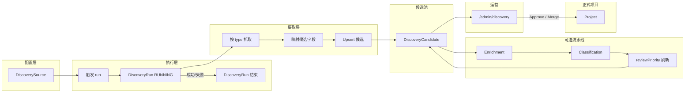

# Discovery Engine V2 — 架构与数据流

本文描述 MUHUB **Discovery V2** 核心模型、数据流与候选生命周期（与旧版 V1 `DiscoveredProjectCandidate` 等并行存在时，以 Prisma 中 `DiscoverySource` / `DiscoveryRun` / `DiscoveryCandidate` 为准）。

## 核心模型

### DiscoverySource

- **含义**：可配置的抓取来源（如 GitHub Topics、GitHub Trending、Product Hunt 榜单/主题）。
- **关键字段**：`key`（唯一）、`name`、`type`（如 `GITHUB`、`PRODUCTHUNT`）、`subtype`（如 `topic`、`trending`、`featured`、`topic`）、`configJson`（抓取参数）、`status`（如 `ACTIVE`）。
- **关系**：`runs[]`、`candidates[]`。

### DiscoveryRun

- **含义**：单次针对某 `DiscoverySource` 的执行实例，用于审计与统计。
- **关键字段**：`status`（`RUNNING` / `SUCCESS` / `FAILED` / `PARTIAL`）、`fetchedCount`、`parsedCount`、`newCandidateCount`、`updatedCandidateCount`、`logJson`、`errorMessage`、`finishedAt`。
- **关系**：归属 `sourceId`；可选关联当次写入的候选（`discoveryRunId` 挂在候选上）。

### DiscoveryCandidate

- **含义**：发现结果的**候选池**实体；**不自动**成为公开 `Project`，需人工审核 / 合并 / 导入。
- **关键字段**：`externalType` / `externalId` / `externalUrl`、`sourceKey`、`normalizedKey`、`dedupeHash`、文案与链接（`title`、`summary`、`website`、`repoUrl`、`docsUrl`…）、`tagsJson` / `categoriesJson`、`metadataJson` / `rawPayloadJson`、分类与补全状态、审核与导入状态、**`reviewPriorityScore`** / **`reviewPrioritySignals`**（运营排序用规则分）。
- **关系**：`sourceId` → `DiscoverySource`；可选 `matchedProjectId`；Enrichment / Classification 任务与链接子表。

## 数据流（高层）

1. **配置**：`ensureDiscoveryDefaultSources()` 等方式确保库内存在默认 `DiscoverySource`。
2. **触发**：管理端 `POST /api/admin/discovery/run` 或 Server Action `runDiscoverySourceByKey`，创建 `DiscoveryRun`。
3. **抓取**：按 `type`/`subtype` 调用对应适配器（GitHub REST/HTML、Product Hunt GraphQL 等）。
4. **映射**：将原始项映射为候选字段与 `rawPayloadJson`。
5. **去重与写入**：`upsertGithubDiscoveryCandidate` / `upsertProductHuntDiscoveryCandidate` 等合并或新建 `DiscoveryCandidate`。
6. **后置流水线**（可选）：Enrichment（链接提取）、规则 Classification；每次持久化更新后刷新 **`reviewPriorityScore`**。
7. **审核**：`/admin/discovery` 列表与详情；Approve / Reject / Ignore / Merge。
8. **落地项目**：导入或合并至 `Project`（草稿、外链、分类 slice 等），见 [project-import-flow.md](../project/project-import-flow.md)。

## 生命周期（候选）

| 阶段 | 典型状态 |
|------|----------|
| 入池 | `reviewStatus=PENDING`，`importStatus=PENDING` |
| 补全 | `enrichmentStatus`：`PENDING` → `OK` / `FAILED` |
| 分类 | `classificationStatus`：`PENDING` → `DONE` →（可选）`ACCEPTED` |
| 审核 | `reviewStatus`：`APPROVED` / `REJECTED` / `IGNORED` / `MERGED` |
| 导入 | `importStatus`：`IMPORTED` / `SKIPPED` / `FAILED` |

已 **IMPORTED** 或 **REJECTED/IGNORED** 的记录遵循既有业务约束，避免重复误操作。

## Discovery V2 流程图（Markdown / Mermaid）

## 相关代码入口（便于跳转）

- 单次运行总线：`lib/discovery/run-discovery-source.ts`
- 默认来源种子：`lib/discovery/seed-default-sources.ts`
- GitHub upsert：`lib/discovery/upsert-candidate.ts`
- Product Hunt upsert：`lib/discovery/upsert-producthunt-candidate.ts`
- 审核优先级：`lib/discovery/review-priority.ts`、`lib/discovery/persist-review-priority.ts`
