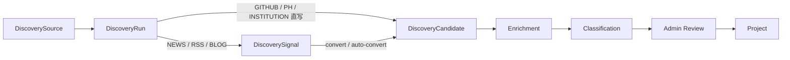
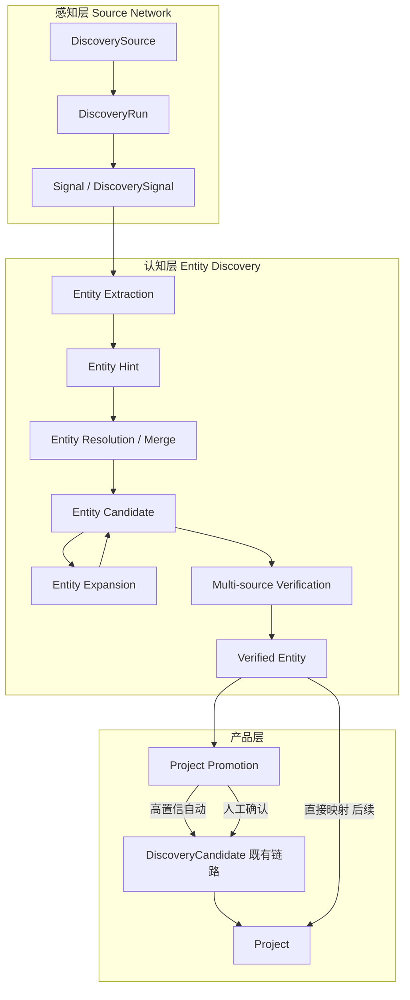
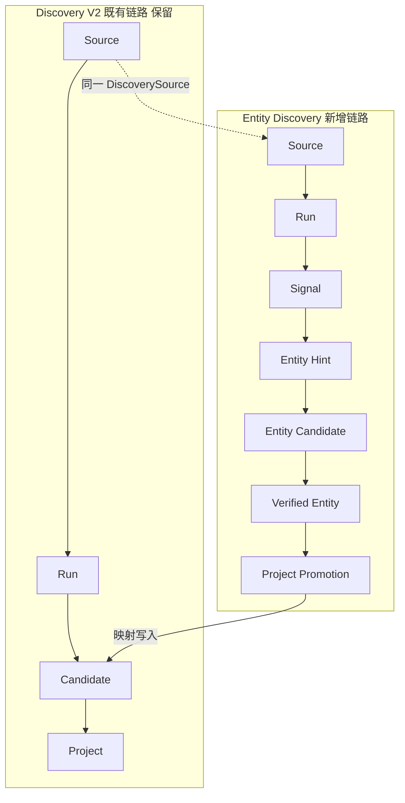
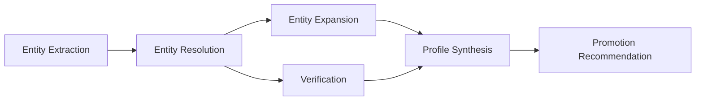
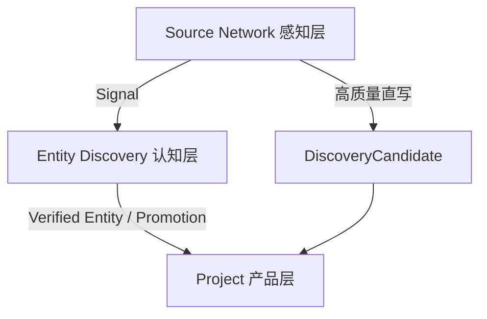

# Entity Discovery Architecture — 技术架构设计

> **文档状态**：设计稿（未进入开发）  
> **版本**：v0.1  
> **日期**：2026-05-27  
> **关联文档**：[Discovery Engine V2 架构](./discovery-architecture.md)、[出版 AI Discovery V2 技术方案](./publishing-ai-discovery-v2-technical-plan.md)、[多来源项目原则](./multi-source-project-principle.md)  
> **首验垂直**：`publishing_ai`

---

## 摘要

MUHUB Discovery 当前主链路假设 **Source 能直接产出结构化 Project 候选**（GitHub repo、Product Hunt 条目、机构列表页外链等）。这在技术产品发现场景有效，但在出版行业等 **权威来源只提供名单、公告、机构、实验室、项目名称等「线索」** 的场景下会系统性失效。

本设计在 **不替代 Discovery V2** 的前提下，新增 **Entity Discovery（实体发现）认知层**：从 Signal 中识别多类型实体线索，经合并、扩展、多源验证后晋升为 Project。Source Network 继续负责感知与 Signal 产出；Entity Discovery 负责实体识别、可信度与 Project Promotion。

**核心结论：**

| 维度 | 结论 |
|------|------|
| 与 V2 关系 | Additive 扩展；现有 `DiscoveryCandidate → Project` 全流程保留 |
| 数据策略 | 第一版新增 2～3 张轻量表 + 大量 JSON 字段；不做复杂关系图谱 |
| 首验范围 | `publishing_ai` scope；不影响主站 general 与 training 现有功能 |
| 人工角色 | 人不维护项目库，而是维护 Source 质量、审核低置信实体、确认 Promotion |
| 对外展示 | 可信度仅内部流程控制；不对用户做评分/评级 |

---

## 一、现状分析

### 1.1 当前 Discovery V2 主链路



**代码与模型依据：**

- `DiscoverySource` / `DiscoveryRun` / `DiscoveryCandidate`：见 `prisma/schema.prisma`
- 运行总线：`lib/discovery/run-discovery-source.ts`
- Signal 层：`DiscoverySignal`（`guessedProjectName`、`guessedWebsiteUrl`、`guessedGithubUrl`）
- Signal → Candidate：`lib/discovery/signals.ts`、`lib/discovery/auto-convert-publishing-signals.ts`
- 机构列表直写 Candidate：`lib/discovery/institution/`（`website_list`、`link_directory` 等 adapter）

### 1.2 适合的场景

当前 **Source → Run → Candidate** 直写模式适合：

| 场景 | 原因 |
|------|------|
| GitHub Topic / Trending / Search | 条目自带 repo、owner、stars、README 等结构化字段 |
| Product Hunt Featured / Topic | 平台页即项目页，title + website + 描述完整 |
| 高质量 RSS 新闻（明确产品发布） | Signal 层可猜测 project name + URL，高置信 auto-convert |
| 机构列表页（外链即官网） | `website_list` adapter 假设每条链接是一个可收录项目 |

共同特征：**单条记录 ≈ 一个可独立收录的项目**，且 **名称、主 URL、类型在来源侧已基本确定**。

### 1.3 不适合的场景

以下出版行业典型来源 **不应要求直接产出 Project**，而应产出 **Entity Hint**：

| 来源类型 | 典型内容 | 当前 V2 的问题 |
|----------|----------|----------------|
| **国家新闻出版署** | 许可公告、机构名单、政策文件 | 条目是机构/单位名，非产品；PDF/公告无 website/repo |
| **行业协会** | 会员名单、实验室挂牌、标准参与单位 | 多为 Organization / Lab，不是可直接上架的 AI 工具 |
| **实验室名单** | 高校/研究所 AI 实验室列表 | 实体类型是 Lab，需扩展才能关联到具体项目/平台 |
| **政策公告** | 产业扶持、试点名单 | 一次公告含多个实体名，需 NER + 分类 |
| **会议名单** | 论坛嘉宾、参展单位、获奖名单 | 名称片段、简称、机构隶属关系需 resolution |

**根因分析：**

1. **类型假设错误**：V2 Candidate 模型与 UI 围绕 `title + website + repoUrl` 的项目形态设计；`DiscoverySignal` 的 `guessedProjectName` 进一步强化了「一切线索都是 Project」的隐含假设。
2. **单源即定论**：Institution adapter 将 HTML 链接直接 upsert 为 Candidate，跳过了 **实体类型判断、多源交叉验证、信息补全**。
3. **证据链断裂**：`referenceSources` 存在于 Candidate/Signal，但没有 **同一实体跨多 Signal 聚合** 的一等公民模型。
4. **出版来源的信息密度低**：名单/公告提供的是 **实体名称 + 上下文片段**，而非 MUHUB Project 所需的主 URL、定位、分类。

### 1.4 与现有 Signal 层的关系

`DiscoverySignal` 已是 **原始信号（Signal）** 的雏形，但职责边界不清：

- 今日：Signal 是「待转化为 Candidate 的新闻线索」
- 目标：Signal 是 **感知层产出**；Entity Hint 是 **认知层产出**

**策略**：复用 `DiscoverySignal` 作为 Signal 存储，新增 `EntityHint` 作为下游实体线索，而非改造 Signal 语义（避免破坏现有 RSS/新闻审核流）。

---

## 二、核心概念设计

### 2.1 概念层次



### 2.2 概念定义

#### Signal（原始信号）

**定义**：从 Source Run 得到的未经实体化解析的原始信息单元。

**形态**：网页、公告、RSS 条目、新闻、名单页、PDF 提取文本、GitHub repo 元数据等。

**现有映射**：`DiscoverySignal`（NEWS/RSS/BLOG）；Institution fetch 的原始 HTML/条目；GitHub/PH 抓取结果在写入 Candidate 前也可视为 Signal（第一版可仅从 Signal 表与 Institution raw 条目切入）。

**关键属性**：`sourceId`、`url`（唯一）、`rawText`、`signalType`、`referenceSources`。

---

#### Entity Hint（实体线索）

**定义**：AI 或规则从单个 Signal 中抽取的 **命名实体线索**，表示「这里可能有一个 X 类型的实体」。

**实体类型（`entityType`）**：

| 类型 | 说明 | 出版场景示例 |
|------|------|--------------|
| `PROJECT` | 可独立收录的 AI 工具/平台/产品 | 「某某 AI 排版助手」 |
| `ORGANIZATION` | 机构、协会、出版社、单位 | 「中国音像与数字出版协会」 |
| `LAB` | 实验室、研究中心 | 「某某大学出版智能实验室」 |
| `TOOL` | 工具（可与 PROJECT 合并或作为子类） | 「PDF 结构化引擎」 |
| `PLATFORM` | 平台型产品 | 「某某内容中台」 |
| `COMPANY` | 商业公司实体 | 「某某科技有限公司」 |
| `DATASET` | 数据集 | 「出版语料 benchmark」 |
| `EVENT` | 会议、活动 | 「出版 AI 创新论坛 2026」 |

**特点**：

- 一个 Signal 可产出 **多个** Entity Hint
- Hint 信息 **不完整** 是正常状态（可以只有 name + entityType + 上下文片段）
- Hint **不直接进入** 广场或 training 项目库

---

#### Entity Candidate（实体候选）

**定义**：经过 **初步合并、去重、补全** 后的候选实体，代表系统对「世界上存在这样一个实体」的最佳当前判断。

**形成方式**：

- 多个 Entity Hint → Entity Resolution → 合并为一条 Entity Candidate
- 单条高置信 Hint 可直接升格为 Candidate

**状态**：`DRAFT` → `ENRICHING` → `PENDING_VERIFICATION` → `VERIFIED` / `REJECTED` / `MERGED`

---

#### Verified Entity（已验证实体）

**定义**：经 **多源验证、内部可信度达到阈值** 的 Entity Candidate。

**与 Candidate 关系**：第一版可为 Candidate 的 `status=VERIFIED` 阶段，不必单独建表；若验证逻辑复杂，可用 `verifiedAt` + `verificationJson` 标记。

**消费方**：Profile 展示（内部）、Project Promotion 决策、未来 training 项目库数据源。

---

#### Project

**定义**：Verified Entity 中 **适合进入 MUHUB 项目展示体系** 的一类实体（通常 `entityType ∈ { PROJECT, TOOL, PLATFORM }` 且通过 Promotion 规则）。

**与现有 Project 关系**：

- Promotion 仍走 **`DiscoveryCandidate` → `approveDiscoveryCandidateImport()`** 或等价映射（第一版）
- `Project.importedFromCandidateId` / `discoverySourceId` 溯源字段继续沿用
- 新增 `promotedFromEntityId`（可选，additive）用于 Entity → Project 追溯

---

## 三、推荐流程

### 3.1 端到端流程

```
Source
  → Signal                          [感知层：已有 + 扩展]
  → Entity Extraction               [认知层：新增]
  → Entity Hint
  → Entity Resolution / Merge
  → Entity Expansion                [可选，Phase E5]
  → Multi-source Verification
  → Entity Candidate
  → Verified Entity
  → Project Promotion
  → DiscoveryCandidate（既有）/ Project
```

### 3.2 与 Discovery V2 并行关系



**并行原则：**

| 原则 | 说明 |
|------|------|
| 不替代 V2 | GitHub/PH 等高质量直写 Candidate 路径不变 |
| Additive | Entity 管线通过 feature flag / scope 开关接入 |
| 汇合点 | Project Promotion 产出 **写入现有 DiscoveryCandidate** 或直接 import，不新建平行 Project 创建路径 |
| Scope 隔离 | 第一版仅对 `discoveryScopes` 含 `publishing_ai` 的 Source/Signal 启用 Entity Extraction |
| 人工审核 | 低置信 Promotion 进入现有 `/admin/discovery` 审核 UI（扩展筛选维度即可） |

### 3.3 来源分流策略

| Source 类型 | 推荐路径 |
|-------------|----------|
| GITHUB / PRODUCTHUNT | 继续 V2 直写 Candidate |
| INSTITUTION `website_list`（general） | 继续 V2 直写 Candidate |
| INSTITUTION `website_list`（publishing_ai 名单/公告） | Run → Signal 或 raw items → **Entity Hint** |
| NEWS / RSS / BLOG（publishing_ai） | Signal → **Entity Extraction** → Entity Hint |
| 政策 PDF / 会议名单（新增 adapter） | Signal → Entity Hint |

---

## 四、数据结构建议

### 4.1 设计原则

1. **第一版不过度关系化**：evidence / profile / verification 以 JSON 为主
2. **支持多来源证据追踪**：`EntityEvidence[]` 嵌入 JSON 或子表二选一
3. **可合并**：`mergedIntoId` 支持实体归并
4. **可追溯到 Signal**：每条 Hint/Evidence 保留 `sourceSignalId` + `sourceUrl`
5. **Scope 一等公民**：`discoveryScopes: string[]`

### 4.2 推荐方案：2 张新表 + JSON 载荷

第一版建议新增 Prisma 模型，避免把实体状态塞进 `DiscoverySignal.metadataJson`（职责混乱、难查询）。

#### 表 1：`EntityHint`

从单个 Signal 抽取的线索，**不可变为主**（新证据产生新 Hint，合并发生在 Candidate 层）。

```typescript
// 逻辑 schema（Prisma 示意）
model EntityHint {
  id              String   @id @default(cuid())
  createdAt       DateTime @default(now())

  // 关联
  sourceSignalId  String
  sourceSignal    DiscoverySignal @relation(...)
  sourceId        String          // 冗余，便于按来源查询
  sourceUrl       String          // Signal.url 快照

  // 实体
  name            String
  entityType      String          // PROJECT | ORGANIZATION | LAB | ...
  aliasesJson     Json?           // string[] 别名
  contextSnippet  String?         @db.Text  // 抽取上下文

  // 抽取结果
  extractionJson  Json?           // AI 原始输出、span、model、promptVersion
  suggestedUrlsJson Json?         // { website?, github?, ... }
  discoveryScopes Json            // string[]

  // 流转
  confidence      Float           @default(0)  // AI 抽取置信度
  status          String          @default("PENDING")  // PENDING | RESOLVED | DISCARDED
  resolvedCandidateId String?

  @@index([sourceSignalId])
  @@index([entityType, status])
  @@index([sourceId, createdAt(sort: Desc)])
}
```

#### 表 2：`EntityCandidate`

合并后的候选实体 + 验证 + Promotion 状态。

```typescript
model EntityCandidate {
  id              String   @id @default(cuid())
  createdAt       DateTime @default(now())
  updatedAt       DateTime @updatedAt

  // 身份
  canonicalName   String
  entityType      String
  aliasesJson     Json?
  discoveryScopes Json

  // 画像（JSON 为主）
  profileJson     Json?           // 合成画像：description, tags, urls, orgAffiliation...
  evidenceJson    Json            // EntityEvidence[] 见 4.3
  verificationJson Json?          // EntityVerification 见 4.4

  // 可信度与状态
  confidence      Float           @default(0)  // 综合内部可信度
  status          String          @default("DRAFT")
  // DRAFT | ENRICHING | PENDING_VERIFICATION | VERIFIED | PROMOTED | REJECTED | MERGED

  mergedIntoId    String?
  mergedInto      EntityCandidate? @relation("EntityMerge", ...)
  mergedFrom      EntityCandidate[] @relation("EntityMerge")

  verifiedAt      DateTime?
  verifiedById    String?         // 人工确认时

  // Promotion
  promotionJson   Json?           // ProjectPromotion 见 4.5
  promotedCandidateId String?     // 写入的 DiscoveryCandidate
  promotedProjectId   String?

  // 审计
  hintIdsJson     Json?           // 关联的 EntityHint id 列表

  @@index([entityType, status])
  @@index([confidence(sort: Desc)])
  @@index([status, updatedAt(sort: Desc)])
}
```

#### 可选表 3：`EntityDiscoveryJob`

异步 AI 任务审计（与 `DiscoveryEnrichmentJob` 对齐），第一版 **可暂缓**，用 `EntityCandidate.profileJson.lastJob` 代替。

### 4.3 EntityEvidence（JSON 结构）

```typescript
type EntityEvidence = {
  id: string;                    // cuid
  sourceSignalId?: string;
  sourceUrl: string;
  sourceName?: string;
  sourceAuthority?: number;      // 0-1 内部权重
  evidenceType: "mention" | "listing" | "official_page" | "news" | "github" | "paper" | "manual";
  extractedAt: string;           // ISO
  snippet?: string;
  rawRef?: { hintId?: string; signalId?: string };
  fields?: Record<string, unknown>;  // 抽取的结构化字段
};
```

**存储位置**：`EntityCandidate.evidenceJson` 为 `EntityEvidence[]`；按 `sourceUrl` 去重。

### 4.4 EntityVerification（JSON 结构）

```typescript
type EntityVerification = {
  computedAt: string;
  overallConfidence: number;
  factors: {
    sourceAuthority: number;
    multiSourceConsistency: number;
    officialSourcePresent: boolean;
    urlConsistency: number;
    freshness: number;
    profileCompleteness: number;
    aiConfidence: number;
    humanConfirmed: boolean;
  };
  rulesApplied: string[];
  aiAssessment?: {
    model: string;
    summary: string;
    conflicts?: string[];
  };
  humanReview?: {
    reviewerId: string;
    action: "confirm" | "reject" | "merge" | "edit";
    note?: string;
    at: string;
  };
};
```

### 4.5 ProjectPromotion（JSON 结构）

```typescript
type ProjectPromotion = {
  recommended: boolean;
  recommendedAt: string;
  reason: string;
  targetEntityType: string;       // 通常 PROJECT | TOOL | PLATFORM
  mappingPreview?: {
    title: string;
    summary?: string;
    website?: string;
    repoUrl?: string;
    primaryCategory?: string;
    tags?: string[];
  };
  status: "pending" | "auto_created" | "awaiting_review" | "confirmed" | "rejected";
  createdCandidateId?: string;
  confirmedById?: string;
  confirmedAt?: string;
};
```

### 4.6 与现有表的关系

| 现有表 | 关系 |
|--------|------|
| `DiscoverySignal` | 1:N → `EntityHint` |
| `DiscoveryCandidate` | Entity Promotion 写入目标；`metadataJson.entityCandidateId` 反向链接 |
| `DiscoverySource` | 通过 Signal / Hint 间接关联；Source Network 不变 |
| `Project` | `promotedProjectId` / 既有 `importedFromCandidateId` |

### 4.7 Migration 建议

**需要 migration**：是（additive）。

```sql
-- Phase E1 最小 migration 示意
CREATE TABLE "EntityHint" (...);
CREATE TABLE "EntityCandidate" (...);
-- 可选
ALTER TABLE "DiscoveryCandidate" ADD COLUMN IF NOT EXISTS "entityCandidateId" TEXT;
ALTER TABLE "Project" ADD COLUMN IF NOT EXISTS "promotedFromEntityId" TEXT;
```

**不需要立即 migration 的**：`EntityEvidence`、`EntityVerification`、`ProjectPromotion` 均为 JSON 字段内容，非独立表。

---

## 五、AI 工作流设计

### 5.1 阶段总览



### 5.2 各阶段 AI 职责

#### 1. Entity Extraction

| 项 | 内容 |
|----|------|
| **输入** | Signal（title, summary, rawText, url, signalType, source 元数据） |
| **输出** | `EntityHint[]`（name, entityType, aliases, contextSnippet, suggestedUrls, confidence） |
| **模型任务** | NER + 类型分类 + 上下文 disambiguation |
| **规则辅助** | 出版关键词表（`keyword-rules.ts`）、来源类型提示（公告/名单/新闻） |
| **触发** | Signal 创建后异步 job；或 Institution 条目 batch 抽取 |

**Prompt 要点**：

- 不要求输出 website/repo
- 明确「一个 Signal 多个实体」
- 对机构名、实验室名、产品名区分 entityType
- 输出 confidence 与抽取依据片段

#### 2. Entity Resolution

| 项 | 内容 |
|----|------|
| **输入** | 新 Hint + 同 scope 下已有 Entity Candidate 索引（name, aliases, type） |
| **输出** | merge 决策：`NEW_CANDIDATE` / `ATTACH_TO {candidateId}` / `DISCARD_DUPLICATE` |
| **方法** | 嵌入相似度 + LLM 判同（「XX 实验室」与「XX 大学出版智能实验室」） |
| **人工** | 低置信 merge 进入审核队列 |

#### 3. Entity Expansion

| 项 | 内容 |
|----|------|
| **输入** | Entity Candidate（name, type, 已有 evidence） |
| **输出** | 新 Evidence（官网、新闻、GitHub、公众号、论文、企查查等公开页） |
| **方法** | 受控搜索（site:、name + 出版 AI 关键词）；结果 URL 分类（复用 `classify-platform.ts`） |
| **边界** | 仅抓取公开页面摘要；不落库全文；遵守 robots / 频率限制 |
| **阶段** | Phase E5；MVP 可人工触发或仅对高价值 Candidate 运行 |

#### 4. Verification

| 项 | 内容 |
|----|------|
| **输入** | Candidate + evidenceJson |
| **输出** | verificationJson + 更新 confidence |
| **规则** | 来源权威性权重、多源 name 一致、official domain 检测 |
| **AI** | 冲突检测（不同来源类型/隶属关系矛盾）、上下文一致性摘要 |

#### 5. Profile Synthesis

| 项 | 内容 |
|----|------|
| **输入** | Verified 或高置信 Candidate + evidences |
| **输出** | profileJson（description, tags, affiliations, keyUrls, publishingRelevance...） |
| **对齐** | 与 `Project.aiStructuredProfileJson` / `aiInsight` 字段语义兼容，便于 Promotion 映射 |

#### 6. Promotion Recommendation

| 项 | 内容 |
|----|------|
| **输入** | Verified Entity + profileJson + scope 规则 |
| **输出** | promotionJson（recommended, mappingPreview, reason） |
| **规则** | 仅 `entityType ∈ { PROJECT, TOOL, PLATFORM }` 且 confidence ≥ 阈值且 profile 完整度达标 |
| **ORG/LAB/EVENT** | 默认不推荐 Promotion，保留为实体资产供未来关系网络使用 |

### 5.3 编排与实现位置（建议）

| 模块 | 建议路径 |
|------|----------|
| Extraction | `lib/discovery/entity/extract-hints-from-signal.ts` |
| Resolution | `lib/discovery/entity/resolve-entity-hints.ts` |
| Expansion | `lib/discovery/entity/expand-entity-candidate.ts` |
| Verification | `lib/discovery/entity/verify-entity-candidate.ts` |
| Profile | `lib/discovery/entity/synthesize-entity-profile.ts` |
| Promotion | `lib/discovery/entity/recommend-project-promotion.ts` |
| 管线入口 | `lib/discovery/entity/run-entity-discovery-pipeline.ts` |
| Feature flag | `lib/discovery/discovery-feature-flags.ts` 扩展 `entityDiscoveryEnabled` |

**调度**：复用 cron / daily workflow 模式（`lib/discovery/daily-discovery-workflow.ts`），在 publishing_ai Source run 之后追加 entity pipeline 步骤。

---

## 六、人机协同机制

### 6.1 人的角色（不维护项目库）

| 人的动作 | 说明 |
|----------|------|
| 提供高质量 Source | 在 Source Network 中配置/审核 `publishing_ai` 权威来源 |
| 修正来源质量 | 调整 Source `configJson`、停用低质量源、标注 `sourceOwner=expert` |
| 审核低置信实体 | Entity Candidate 合并/类型/名称纠错 |
| 确认 Project Promotion | 批准或拒绝 AI 的 Promotion 建议 |
| 修正 AI 错误 | 拒绝错误 Hint、拆分错误 merge、补充 evidence |

### 6.2 自动化 vs 人工确认

| 环节 | 自动化程度 | 人工触发条件 |
|------|------------|--------------|
| Signal 抓取 | 全自动 | Source 失效 / 需新增源 |
| Entity Extraction | 全自动 | — |
| Hint → Candidate 合并 | 高置信自动 | confidence < 0.75 或跨 type merge |
| Entity Expansion | 半自动（Phase E5） | 默认仅 VERIFIED 候选 |
| Verification 计算 | 全自动 | — |
| Verified 判定 | 阈值自动 | confidence ∈ [0.55, 0.85) 人工确认 |
| Project Promotion | 高置信自动创建 Candidate | confidence < 0.88 或缺 primary URL |
| Candidate → Project | 既有审核流 | Approve import（不变） |

### 6.3 学习人的修正

第一版 **轻量反馈**，不做在线 fine-tune：

| 修正类型 | 存储 | 后续用途 |
|----------|------|----------|
| 拒绝 Hint | `EntityHint.status=DISCARDED` + reason |  few-shot 负例 |
| 确认/修改 merge | `verificationJson.humanReview` | Resolution prompt 示例 |
| 修改 entityType | `profileJson.manualOverrides` | 类型分类 few-shot |
| 确认 Promotion | `promotionJson.confirmedById` | 阈值校准样本 |
| Source 停用 | `DiscoverySource.status` | 来源权威性权重调整 |

**阈值渐进策略**：每两周根据人工确认/拒绝比微调 `AUTO_VERIFY_THRESHOLD`、`AUTO_PROMOTE_THRESHOLD`（配置化，非硬编码）。

### 6.4 逐步减少人工干预

```
Phase E1-E2: 100% Hint 人工抽检（admin 列表）
Phase E3:    仅低置信 Candidate 人工队列
Phase E4:    Promotion 人工确认 → 抽检
Steady:      人工仅处理 conflict 队列 + 新 Source 冷启动
```

---

## 七、可信度体系（Entity Confidence System）

### 7.1 设计原则

- **仅内部流程控制**：驱动自动 merge、verify、promote；**不对用户展示分数或评级**
- **可解释**：`verificationJson.factors` + `rulesApplied` 供管理员 debug
- **与 reviewPriorityScore 并存**：后者服务 Candidate 审核排序；Entity confidence 服务认知层状态机

### 7.2 因子与权重（初始建议）

| 因子 | 权重方向 | 说明 |
|------|----------|------|
| `sourceAuthority` | 高 | 新闻出版署 > 协会官网 > 一般媒体 > 自媒体 |
| `multiSourceConsistency` | 高 | ≥2 个独立来源出现同名/别名 |
| `officialSourcePresent` | 高 | 存在独立域名官网或 .gov/.edu.cn 页面 |
| `urlConsistency` | 中 | 多源指向同一主 URL |
| `freshness` | 中 | 最近 12 个月内有新 evidence |
| `profileCompleteness` | 中 | name + type + description + ≥1 URL |
| `aiConfidence` | 中 | 抽取/verification LLM 自报置信度 |
| `humanConfirmed` | 最高 | 人工确认后置信度下限托底 |

### 7.3 阈值（可配置）

| 阈值 | 建议初值 | 效果 |
|------|----------|------|
| `HINT_DISCARD` | < 0.35 | 自动丢弃噪声 Hint |
| `MERGE_AUTO` | ≥ 0.75 | 自动合并 Hint |
| `VERIFY_AUTO` | ≥ 0.85 | 自动标记 VERIFIED |
| `PROMOTE_AUTO` | ≥ 0.88 + 完整 profile | 自动创建 DiscoveryCandidate |
| `PROMOTE_REVIEW` | 0.70–0.88 | 人工 Promotion 队列 |

### 7.4 来源权威性配置

在 `DiscoverySource.configJson` 或 scope 级配置中增加：

```json
{
  "sourceAuthorityTier": "regulatory" | "industry_association" | "institution" | "media" | "community",
  "entityExtractionEnabled": true
}
```

---

## 八、与 Source Network 的关系

### 8.1 分层定义

| 层 | 名称 | 职责 | 现有实现 |
|----|------|------|----------|
| **感知层** | Source Network | 发现与管理信息源；跑 Source；产出 Signal | `DiscoverySource` + `lib/discovery/source-network/` |
| **认知层** | Entity Discovery | 从 Signal 识别实体；合并；补全；验证；推进 Project | **本设计新增** |
| **产品层** | Project / Training | 展示、training 消费、AI enrichment | `Project`、`app/training/projects` |



### 8.2 Source Network 不负责

- 实体类型判断
- 跨 Signal 实体合并
- 可信度计算
- Project 上架决策

### 8.3 Source Network 增强（非必须，建议）

- Source 表单增加 `entityExtractionEnabled`、`sourceAuthorityTier`
- Source 详情页展示 **signalCount → hintCount → candidateCount → promotedCount** 漏斗（扩展 `source-yield.ts`）

---

## 九、与 training.muhub.cn 的关系

### 9.1 当前状态

- `training.muhub.cn/projects` 曾使用静态卡片；按 [出版 AI Discovery V2 技术方案](./publishing-ai-discovery-v2-technical-plan.md) 逐步改为读 `Project`（`discoveryScopes` 含 `publishing_ai`）
- training **不直接消费** Signal 或 Entity Hint

### 9.2 目标数据流

```
Entity Discovery
  → Verified Entity / Project Promotion
  → DiscoveryCandidate → Project（discoveryScopes: publishing_ai）
  → training.muhub.cn/projects 列表 API
```

### 9.3 约束

| 约束 | 说明 |
|------|------|
| 不破坏现有 training 功能 | 报名、作业 JSON 存储不变 |
| 不暴露内部 confidence | training 仅展示已发布 Project |
| 项目库来源 | 最终来自 Entity Discovery + Promotion，而非静态卡片或单一 RSS 直转 |
| 过渡期 | V2 直写 Candidate 的 publishing 项目仍可展示；与 Entity 路径并存 |

---

## 十、分阶段落地建议

### Phase E1：Entity Hint 抽取

**目标**：从权威来源的 Signal 中抽取 Entity Hint。

| 项 | 内容 |
|----|------|
| 范围 | `publishing_ai` Signal；Institution 名单类条目 |
| 交付 | `EntityHint` 表 + extraction job + admin 只读列表 |
| 不接 | Promotion、自动 merge |

**验收**：

- 对 ≥3 类出版来源（如 RSS 公告、协会名单页、政策摘要）能抽取 Hint
- 单 Signal 多实体正确拆分（人工抽检 ≥80%）
- Hint 含 name、entityType、confidence、sourceUrl

---

### Phase E2：Entity Evidence 存储

**目标**：Hint 合并为 Entity Candidate，支持多来源 evidence。

| 项 | 内容 |
|----|------|
| 交付 | `EntityCandidate` 表 + Resolution job + evidenceJson 追加逻辑 |
| Admin | Candidate 详情页展示 evidence 时间线 |

**验收**：

- 同一实体 2+ Signal 的 Hint 合并为 1 Candidate
- evidenceJson 可追踪每条 evidence 的 sourceUrl / signalId
- 错误 merge 可人工拆分（status=MERGED + mergedIntoId）

---

### Phase E3：Entity Verification

**目标**：AI + 规则计算内部可信度，自动/人工 Verified。

| 项 | 内容 |
|----|------|
| 交付 | verificationJson + confidence 刷新 job + 人工确认 action |
| 配置 | 来源权威性 tier + 阈值 config |

**验收**：

- Verified 实体 confidence ≥ 配置阈值
- 低置信实体进入人工队列
- verificationJson 可解释 factors

---

### Phase E4：Project Promotion

**目标**：高可信实体进入现有 Candidate 审核流或直接 import。

| 项 | 内容 |
|----|------|
| 交付 | Promotion recommendation + 映射到 `DiscoveryCandidate` + 现有 approve 流 |
| 汇合 | `metadataJson.entityCandidateId` 双向链接 |

**验收**：

- ≥1 条出版 AI 实体经 Entity 路径完整进入 `Project`（`discoveryScopes` 含 `publishing_ai`）
- training 项目库可展示该 Project（若 training 读库已上线）
- 既有 GitHub/PH Candidate 路径不受影响

---

### Phase E5：Entity Expansion

**目标**：围绕实体自动搜索补全 evidence 与 profile。

| 项 | 内容 |
|----|------|
| 交付 | Expansion job + profileJson 合成 |
| 触发 | 手动按钮或 Verified 后自动 |

**验收**：

- 对 ≥5 个 Candidate 自动发现官网或 GitHub 证据
- profileJson 含 description + keyUrls
- 搜索频率受控，无封禁事件

---

## 十一、风险与边界

### 11.1 明确不做

| 边界 | 说明 |
|------|------|
| 公开评分/评级 | confidence 不对用户展示 |
| 人工研究报告 | 人不写长文研究；仅审核与 Source 策展 |
| 复杂知识图谱 | 不做 Neo4j 式关系网；最多 JSON 存 `{ relatedEntityIds[] }` |
| 替换 Discovery V2 | 不删除 Candidate 直写路径 |
| 影响主站/training 现有功能 | Feature flag + scope 隔离 |
| 全 vertical 同步上线 | 先 `publishing_ai` |

### 11.2 风险与缓解

| 风险 | 缓解 |
|------|------|
| AI 幻觉实体 | 多源 verification + 低置信人工队列 |
| 同名不同实体 | Resolution 保守 + 人工 split |
| 与 V2 Candidate 重复 | Promotion 时检查 `normalizedKey` / dedupeHash |
| 抓取合规 | Expansion 限速；仅公开摘要 |
| 范围膨胀 | Phase 门禁；E5 可选 |

---

## 十二、输出清单

### 12.1 建议新增/修改文件清单

#### 文档

| 文件 | 动作 |
|------|------|
| `docs/discovery/entity-discovery-architecture.md` | **新增**（本文） |
| `docs/discovery/discovery-architecture.md` | 修改：增加 Entity Discovery 并行链路说明（1 段 + 链接） |

#### Prisma / Migration

| 文件 | 动作 |
|------|------|
| `prisma/schema.prisma` | 新增 `EntityHint`、`EntityCandidate` |
| `prisma/migrations/YYYYMMDD_entity_discovery_e1/` | E1 migration |

#### 库代码（按 Phase）

| 文件 | Phase |
|------|-------|
| `lib/discovery/entity/types.ts` | E1 |
| `lib/discovery/entity/extract-hints-from-signal.ts` | E1 |
| `lib/discovery/entity/entity-confidence.ts` | E3 |
| `lib/discovery/entity/resolve-entity-hints.ts` | E2 |
| `lib/discovery/entity/verify-entity-candidate.ts` | E3 |
| `lib/discovery/entity/recommend-project-promotion.ts` | E4 |
| `lib/discovery/entity/map-entity-to-candidate.ts` | E4 |
| `lib/discovery/entity/run-entity-discovery-pipeline.ts` | E2+ |
| `lib/discovery/entity/expand-entity-candidate.ts` | E5 |
| `lib/discovery/entity/synthesize-entity-profile.ts` | E5 |
| `lib/discovery/discovery-feature-flags.ts` | E1（扩展） |
| `lib/discovery/publishing/entity-discovery-hook.ts` | E1（publishing 入口） |

#### Admin UI

| 文件 | Phase |
|------|-------|
| `app/admin/discovery/entities/page.tsx` | E1 列表 |
| `app/admin/discovery/entities/[id]/page.tsx` | E2 详情 |
| `app/admin/discovery/entities/actions.ts` | E2+ |
| `app/admin/discovery/signals/actions.ts` | E1（触发 extract） |

#### 脚本 / 验收

| 文件 | Phase |
|------|-------|
| `scripts/acceptance-entity-discovery-e1.ts` | E1 |
| `scripts/seed-publishing-entity-sources.ts` | E1（可选） |

#### 修改（小范围）

| 文件 | 动作 |
|------|------|
| `lib/discovery/daily-discovery-workflow.ts` | E2+ 追加 entity pipeline 步骤 |
| `lib/discovery/source-network/source-yield.ts` | E2+ 增加 hint/candidate 计数 |
| `lib/discovery/run-discovery-source.ts` | E1 可选：publishing INSTITUTION 写 Signal 而非直写 Candidate |

### 12.2 Migration 是否需要

| Phase | Migration |
|-------|-----------|
| E1 | **是** — `EntityHint` 表 |
| E2 | **是** — `EntityCandidate` 表 |
| E3 | 否（JSON 字段内） |
| E4 | **可选** — `DiscoveryCandidate.entityCandidateId`、`Project.promotedFromEntityId` |
| E5 | 否 |

所有 migration 均为 **additive**，可独立回滚。

### 12.3 MVP 开发阶段建议

**MVP = Phase E1 + E2 + E3 最小闭环 + E4 人工 Promotion（无自动 promote）**

| 周次 | 内容 |
|------|------|
| W1 | E1：schema + extraction + admin Hint 列表 |
| W2 | E2：resolution + Candidate + evidence |
| W3 | E3：verification + 人工确认 + confidence |
| W4 | E4：人工触发 Promotion → DiscoveryCandidate → 现有 import |

E5（Expansion）与自动 Promotion 放在 MVP 之后。

### 12.4 验收标准（MVP 总表）

| # | 标准 |
|---|------|
| A1 | `EntityHint`、`EntityCandidate` 表存在且 migration 可应用 |
| A2 | 至少 3 个 `publishing_ai` Source 产出 Hint |
| A3 | 多 Signal 合并为单 Candidate，evidence 可追溯 |
| A4 | verificationJson 驱动 status=VERIFIED，低置信进人工队列 |
| A5 | 至少 1 个 Verified Entity 经人工 Promotion 进入 Project |
| A6 | GitHub/PH 直写 Candidate 路径回归通过 |
| A7 | 主站 `/projects` 与 training 现有页面无 regression |
| A8 | 用户侧无可信度/评分展示 |

### 12.5 暂不开发

| 内容 | 原因 |
|------|------|
| 知识图谱 / 实体关系 UI | 超出第一版边界 |
| 公开 Entity 浏览页 | 非 publishing MVP 目标 |
| 自动 Entity Expansion（E5） | MVP 后；降低抓取与幻觉风险 |
| 自动 Project Promotion | MVP 仅人工确认 Promotion |
| 全 scope 启用 | 先 publishing_ai |
| LLM 在线 fine-tune | 先用 few-shot + 阈值校准 |
| 替代 DiscoverySignal 模型 | 复用现有 Signal |
| Institution 全量改 Signal 流 | 按 scope 渐进切换 |
| Verified Entity 直写 Project（跳过 Candidate） | 第二版再评估 |

---

## 附录 A：出版来源 → Entity Type 映射示例

| 来源 | Signal 示例 | 典型 Hint |
|------|-------------|-----------|
| 新闻出版署公告 | 「准予 XX 单位从事...」 | ORGANIZATION |
| 协会实验室名单 | 「XX 出版 AI 实验室」 | LAB |
| 行业会议议程 | 「XX 公司 CTO 张三」 | COMPANY / EVENT |
| 政策试点名单 | 「试点单位：A、B、C」 | ORGANIZATION × N |
| 科技新闻 | 「XX 发布 AI 校对工具」 | PROJECT / TOOL |

---

## 附录 B：与现有多来源原则的对齐

本设计落实 [多来源项目原则](./multi-source-project-principle.md) 中「Signal ≠ Project Source」「多源归并」方向：

- **Signal** 保持动态线索定位
- **Entity Evidence** 承担多源 Source 聚合
- **Project** 仍为核心产品对象，通过 Promotion 从 Verified Entity 晋升，而非要求 Source 直出 Project

---

## 附录 C：术语对照

| 新术语 | 现有最接近概念 |
|--------|----------------|
| Signal | `DiscoverySignal` |
| Entity Hint | 无（新增） |
| Entity Candidate | 部分类似 `DiscoveryCandidate`，但类型更广、证据驱动 |
| Verified Entity | 无（新增状态） |
| Project Promotion | 部分类似 `convertDiscoverySignalToCandidate` + import |

---

## 十三、E1 实施记录（2026-05-28）

> **状态**：已实施（Phase E1）  
> **范围**：EntityHint 抽取 + Admin 列表；不含 EntityCandidate / merge / verification / promotion

### 13.1 EntityHint Schema（已实现）

Prisma 模型 `EntityHint`（migration: `20260528140000_entity_discovery_e1`）：

| 字段 | 类型 | 说明 |
|------|------|------|
| `id` | String | cuid |
| `name` | String | 实体名称 |
| `normalizedName` | String | 去重用规范化名 |
| `entityType` | String | PROJECT / ORGANIZATION / LAB / … |
| `discoveryScopes` | Json? | string[] |
| `sourceSignalId` | String? | 关联 DiscoverySignal |
| `sourceUrl` | String? | Signal URL 快照 |
| `sourceTitle` | String? | Signal 标题快照 |
| `sourceTextSnippet` | String? | 抽取上下文片段 |
| `evidenceJson` | Json? | 抽取方法与来源元数据 |
| `confidence` | Float? | AI/规则置信度 |
| `status` | String | PENDING / ACCEPTED / REJECTED / MERGED_LATER |
| `reason` | String? | 抽取依据或人工备注 |
| `dedupeKey` | String @unique | `sourceSignalId:normalizedName:scopes` |
| `createdAt` / `updatedAt` | DateTime | 审计 |

### 13.2 Feature Flags

```env
ENTITY_DISCOVERY_ENABLED=true
ENTITY_HINT_EXTRACTION_ENABLED=true
```

关闭后现有 Discovery V2 行为不变；脚本可用 `--force` 绕过（仅开发/验收）。

### 13.3 使用方式

**批量抽取（推荐）：**

```bash
pnpm prisma migrate deploy
pnpm tsx scripts/extract-entity-hints.ts --scope publishing_ai --limit 50
```

**选项：**

| 参数 | 说明 |
|------|------|
| `--scope publishing_ai` | 仅处理含该 scope 的 Signal 来源 |
| `--limit 50` | 最多处理 Signal 条数 |
| `--dry-run` | 只抽取不写入 |
| `--no-ai` | 仅规则抽取 |
| `--signal-id <id>` | 单条 Signal |
| `--force` | 忽略 feature flag |

**Admin 页面：**

- 列表：`/admin/discovery/entities`
- 详情：`/admin/discovery/entities/[id]`
- Signal 详情页：「抽取 Entity Hint」按钮

**验收脚本：**

```bash
pnpm tsx scripts/acceptance-entity-discovery-e1.ts
```

### 13.4 E1 已实现文件

| 路径 | 职责 |
|------|------|
| `prisma/schema.prisma` | EntityHint 模型 |
| `prisma/migrations/20260528140000_entity_discovery_e1/` | migration |
| `lib/discovery/entity/types.ts` | 类型与常量 |
| `lib/discovery/entity/normalize-name.ts` | 名称规范化与 dedupeKey |
| `lib/discovery/entity/extract-from-signal.ts` | 规则 + 可选 AI 抽取 |
| `lib/discovery/entity/persist-hints.ts` | 持久化与批量入口 |
| `lib/discovery/discovery-feature-flags.ts` | ENTITY_* flags |
| `app/admin/discovery/entities/**` | Admin 列表/详情/审核 |
| `scripts/extract-entity-hints.ts` | CLI 批量抽取 |
| `scripts/acceptance-entity-discovery-e1.ts` | E1 验收 |

### 13.5 E1 验收标准

| # | 标准 | 状态 |
|---|------|------|
| E1-A1 | EntityHint 表 migration 可 deploy | 待运行验证 |
| E1-A2 | `--scope publishing_ai` 脚本可跑并输出统计 | 待运行验证 |
| E1-A3 | Admin `/admin/discovery/entities` 可列表/筛选/ACCEPT/REJECT | 已实现 |
| E1-A4 | 同一 Signal 重复抽取不产生 duplicate Hint（dedupeKey） | 已实现 |
| E1-A5 | 无实体时不报错，计入 skipped | 已实现 |
| E1-A6 | 不影响现有 Candidate/Signal/training/主站 | 设计保证 |

### 13.6 E1 暂不开发（延续 12.5）

- EntityCandidate 表
- Entity merge / resolution
- 多源 verification
- Project promotion
- Entity expansion
- 公开 Entity 页面
- training 页面改造

### 13.7 下一步（E2 建议）

进入 E2 前建议：

1. 用 E1 跑通 ≥50 条 publishing_ai Signal，人工抽检 Hint 质量
2. 根据误报调整 `extract-from-signal.ts` 规则
3. 再设计 `EntityCandidate` + evidence 聚合与 Resolution job

### 13.8 WEBSITE_SCAN 与 Entity E1 联动（2026-05-28）

**WEBSITE_SCAN**（`configJson.mode = "website_scan"`）是受控 BFS 站点扫描，产出 **DiscoverySignal**（非 Candidate）。

- 模块：`lib/discovery/website-scan/`
- 入口：`run-discovery-source.ts`（mode 检测优先于 type 分支）
- Signal `metadataJson` 含：pageUrl、snippet、matchedKeywords、depth、parentUrl、confidence、scanMode
- 下游：现有 `extract-entity-hints.ts` / E1 Admin；**不做 E2**

测试来源：`publishing-website-scan-dpresearch`（数字出版研究）。

### 13.9 AI Entity Judge（E1.5，2026-05-28）

在 E1 规则抽取与 E2 Resolution 之间增加 **AI Entity Judge**，提高单位 Signal 的实体识别质量。

- 模块：`lib/discovery/entity/ai-entity-judge.ts`
- 调用：`lib/ai/generate-text.ts`（OpenAI 兼容 Chat Completions）
- **WEBSITE_SCAN 默认启用**；RSS 暂保留 E1 规则 + 旧版 AI 抽取
- 技术失败时回退规则抽取；AI 明确拒绝时不回退
- 阈值：`confidence >= 0.75`、`publishingAiRelevance >= 0.60`、`shouldCreateHint=true`
- `evidenceJson.judge = "ai_entity_judge"` 写入 AI 理由与 evidence
- **不做** EntityCandidate / merge / Project Promotion

脚本：

```bash
pnpm tsx scripts/extract-entity-hints.ts --scope publishing_ai --limit 50 --force --ai-judge
```

### 13.10 Feedback Learning MVP（E1.6，2026-05-28）

建立 **结构化人工反馈数据层**（Industry Cognition Layer 语料），不训练模型、不做 E2。

- 表：`EntityHintFeedback`（action、reviewer、feedbackTags、notes、isHighValue、shouldTrackLongTerm）
- CRUD：`lib/discovery/entity/feedback-crud.ts`
- Admin：`/admin/discovery/entities/[id]` — ACCEPT / REJECT / UNSURE + 反馈历史
- 导出：`scripts/export-entity-feedback-dataset.ts` → JSONL
- Judge 联动：`feedback-examples-for-judge.ts` 注入少量最近反馈样例到 prompt
- Feature flag：`ENTITY_FEEDBACK_ENABLED`（关闭仅隐藏 UI）

---

*文档更新：E1 已实施；E1.5 AI Entity Judge 已接入；E1.6 Feedback Learning MVP 已接入；WEBSITE_SCAN MVP 已接入 Signal 层；E2+ 仍按原 Phase 规划推进。*

