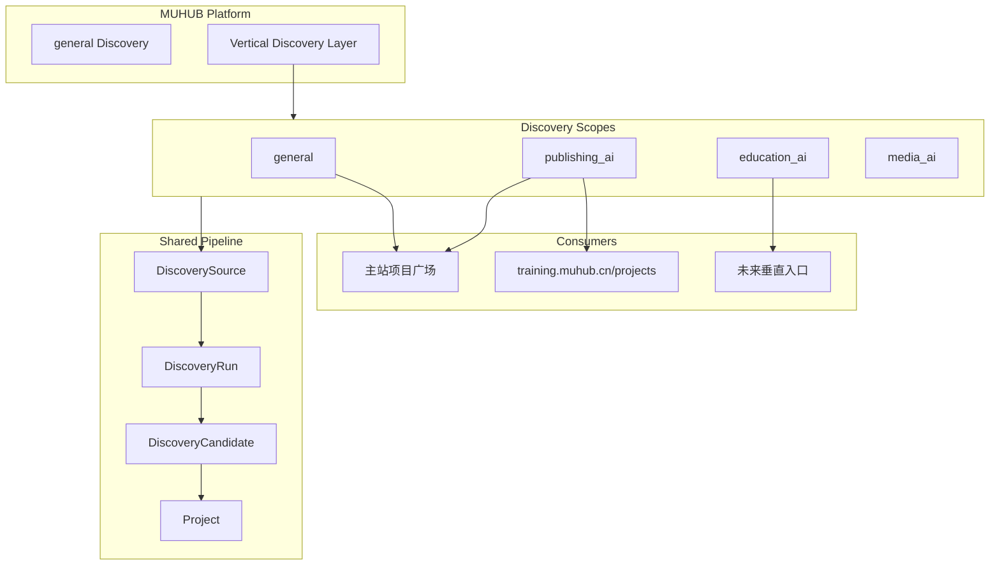
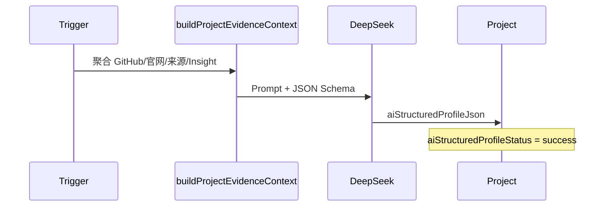

# 出版 AI Discovery V2 技术设计方案

> **文档状态**：实施中（Phase 1 + Phase 2 已启动）  
> **目标上线**：2026 年 6 月初（training.muhub.cn 投入运行）  
> **关联规划**：[《出版AI Discovery V2 规划》（草案）](../《出版AI Discovery V2 规划》（草案）.md)  
> **当前优先级**：**项目覆盖率优先** — Discovery 深度 > 页面展示

---

## 摘要

本方案在 MUHUB 现有 **Discovery V2 + Project AI 字段体系** 之上，引入 **Vertical Discovery（垂直行业发现）** 平台能力。当前优先落地 `publishing_ai` scope，服务 `training.muhub.cn/projects` 出版 AI 项目库入口；架构预留 `general`、`education_ai`、`media_ai` 等扩展，**不破坏主站广场、Discovery 审核流与 training 已有功能**。

核心策略：**轻量 JSON 扩展 + 复用现有流水线 + 新增垂直 scope 语义**，避免重运营、人工研究层、复杂分类与主观评分。

### 产品理念：Discovery is Product

**Discovery 不是后台工具，而是 MUHUB 最核心产品能力之一。**

未来以下能力都建立在 Discovery 之上：

- 项目生态
- AI 关系网络
- 行业发现
- AI 传播
- 项目情报

本阶段建设目标是 **AI Native Discovery System**，而非人工维护型内容平台。

### 补充原则：AI 生成信息优先于人工运营信息

当前阶段，以下能力**优先级高于**人工编辑 / 研究 / 策展体系：

| 优先（AI） | 低优先（人工） |
|------------|----------------|
| AI 生成 | 人工编辑体系 |
| AI 结构化 | 人工研究体系 |
| AI 摘要 | 人工策展体系 |
| AI 动态聚合 | 重运营 CMS |

**避免系统逐渐演化为重运营 CMS。**

### 当前最值得强化的能力（按优先级）

1. **Seed Sources**（最高）
2. **AI Discovery**（最高）
3. **AI Relationship**（项目关联，后续 Phase）
4. **AI Duplicate Resolution**（重复识别，后续 Phase）

当前真正核心不是页面，而是 **Discovery 深度**。

---

## 一、现状判断

### 1.1 当前相关结构

#### Discovery V2（Prisma 主链路）

| 模型 | 路径/入口 | 职责 |
|------|-----------|------|
| `DiscoverySource` | `prisma/schema.prisma` | 可配置抓取来源；`type`（GITHUB / PRODUCTHUNT / INSTITUTION / NEWS / SOCIAL / BLOG）；`configJson` 存参数 |
| `DiscoveryRun` | `lib/discovery/run-discovery-source.ts` | 单次执行审计 |
| `DiscoveryCandidate` | `lib/discovery/upsert-candidate.ts` | 候选池，审核后导入 Project |
| `DiscoverySignal` | `lib/discovery/signals.ts` | 新闻/社媒/博客线索层，可转候选 |

**运行入口：**

- 管理端：`POST /api/admin/discovery/run`、`/admin/discovery`
- 定时：`GET /api/cron/daily-discovery` → `lib/discovery/daily-discovery-workflow.ts`
- 候选导入：`lib/discovery/import-candidate.ts` → `approveDiscoveryCandidateImport()`

**数据流：** Source → Run → Candidate/Signal → Enrichment → Classification → Review → Import → Project → AI Enrichment

#### Project 模型

Project 已具备较完整的 AI 与 Discovery 溯源字段（`prisma/schema.prisma`）：

| 字段族 | 代表字段 | 用途 |
|--------|----------|------|
| 分类 | `primaryCategory`, `categoriesJson`, `isAiRelated`, `isChineseTool` | 广场筛选；出版当前用 `publishing_media` |
| AI 认知 | `aiInsight` (Json), `aiKnowledgeJson`, `aiSignals`, `aiSourceLevel` | 分散的结构化 AI 输出 |
| AI 状态 | `aiStatus`, `aiInsightStatus`, `aiContentStatus` | 异步任务状态 |
| Discovery 溯源 | `discoverySource`, `discoverySourceId`, `discoveredAt`, `importedFromCandidateId` | 候选导入追溯 |
| 来源 | `ProjectSource`, `ProjectExternalLink`, `referenceSources` | 多源证据 |

**展示层：**

- 广场列表：`lib/project-list.ts` + `app/projects/page.tsx`（支持 `?category=publishing_media`）
- 详情映射：`lib/map-project-row.ts` → `ProjectPageView`

#### training.muhub.cn / projects

| 项 | 现状 |
|----|------|
| 路由 | `middleware.ts` 将 `training.muhub.cn` rewrite 至 `/training/**` |
| 项目页 | `app/training/projects/page.tsx` — **硬编码 5 张静态卡片**，不读数据库 |
| 数据 | 无 Prisma 依赖；报名/作业用 `data/training-*.json` |
| 外链 | 卡片内链至主站 `/projects?category=publishing_media` |

#### 出版垂直已有资产（未完全打通）

| 资产 | 路径 | 状态 |
|------|------|------|
| 出版项目种子 | `scripts/seed-publishing-projects*.ts` | 写入 `primaryCategory: publishing_media` |
| 出版来源种子 | `scripts/seed-publishing-sources.ts` | `configJson.industry: "publishing"`，`mode: "rss"` |
| 出版分类规则 | `lib/discovery/classification/keyword-rules.ts` | `PUBLISHING_SCENE_TAGS` 等 |
| AI 出版扩展 | `lib/project-ai-insight.ts` | `publishingSceneTags`, `publishingAnalysis`, `publishingRelevance` |
| RSS 抓取（旧轨） | `agents/discovery/rss/rss-discovery.ts` | 写 JSON 队列，**未接入** V2 `run-discovery-source.ts` |

#### 遗留/并行系统（认知负担，V2 不扩展）

- V1 `DiscoveredProjectCandidate` 表
- JSON 队列：`data/discovery-items.json`、`agents/discovery/discovery-store.ts`
- Growth Content Bundle：`data/content-bundles.json`（与 Discovery/Project 无直接关联）

### 1.2 可复用能力

| 能力 | 复用方式 |
|------|----------|
| Discovery V2 全链路 | Source → Run → Candidate → Review → Import，**仅扩展 scope 语义与 RSS 适配** |
| 候选导入映射 | `import-candidate.ts` + `sync-discovery-to-project.ts` |
| 规则分类 | `classify-candidate.ts`、`keyword-rules.ts`（出版关键词已存在） |
| Enrichment | GitHub README、外链补全、`run-enrichment-job.ts` |
| Project AI 管线 | `scheduleProjectAiEnrichment`、`lib/project-ai-insight.ts`、`lib/project-knowledge.ts` |
| 广场查询 | `lib/project-list.ts` 的 category / q / sort 筛选 |
| 出版种子脚本 | `seed-publishing-sources.ts`、`seed-publishing-projects*.ts` 可扩展 |
| Training 基础设施 | `middleware.ts` rewrite、PWA、`TrainingPageShell` 组件 |
| Institution 适配器框架 | `lib/discovery/institution/`（机构列表、manual seed） |

### 1.3 需要新增能力

| 缺口 | 说明 |
|------|------|
| **Vertical Discovery scope 一等公民** | 无 `discoveryScope` / `vertical` 顶层字段；出版仅通过 `primaryCategory` + `configJson.industry` 隐式表达 |
| **统一 AI 结构化项目画像** | AI 输出分散在 `aiInsight`、`aiKnowledgeJson` 等，消费方（training 项目库）需拼装 |
| **出版 RSS 源接入 V2 运行总线** | `seed-publishing-sources.ts` 中 `mode: "rss"` 的 NEWS/BLOG 源，当前 NEWS 分支仅处理 `signals` 种子 |
| **training/projects 读真实项目库** | 静态卡片 → 读 `publishing_ai` scope 已发布项目 |
| **scope 级 seed sources 管理** | 按 scope 组织、筛选、调度来源 |
| **AI 关键词扩展 / 关联发现** | 提升覆盖率，Phase 4+ 建设 |

### 1.4 不能动的区域

遵循 [training V1 开发边界](../training/training-project-background-and-v1-plan.md) 及平台稳定性原则：

| 区域 | 原因 |
|------|------|
| MUHUB 主站首页、主导航结构 | 非本阶段目标；training 仅作子域入口 |
| 项目广场主流程（`/projects` 默认行为、排序逻辑） | 不因 vertical 改造改变 general 用户体验 |
| Discovery 审核主流程语义 | Approve/Reject/Merge 契约不变；仅增加 scope 筛选维度 |
| 现有项目导入、认领、营销内容工作流 | 独立产品线，V2 只做 additive 扩展 |
| `prisma/archived/**`、基线 migration | 迁移治理约束 |
| `data/training-registrations.json`、`data/training-homework.json` | 用户提交数据；V2 不迁移其存储方式 |
| V1 JSON Discovery 队列 | 不删除、不重构；V2 走 Prisma 主链路 |
| `reviewPriorityScore` 对外暴露 | 仅后台审核排序，**不对 training/广场用户展示** |

**允许修改范围（实施期）：**

- `prisma/schema.prisma`（additive migration）
- `lib/discovery/**`（扩展，非重写）
- `lib/projects/**`、`lib/project-ai-insight.ts`（additive）
- `app/training/projects/**` 及必要 `app/training/lib/**`
- `scripts/seed-publishing-*.ts`
- `docs/discovery/**`

---

## 二、核心架构：Vertical Discovery

### 2.1 概念定义

**Vertical Discovery** 是在 MUHUB 通用 Discovery 之上的一层 **行业定向发现与展示语义**，不改变候选→项目的基本生命周期，而是：

1. 为 **DiscoverySource**、**DiscoveryCandidate**、**Project** 标注 **discovery scope**
2. 为每个 scope 配置 **seed sources**（来源集合）
3. 为每个 scope 提供 **消费入口**（如 training 出版 AI 项目库、未来教育 AI 频道）



### 2.2 Scope 枚举（建议）

定义于 `lib/discovery/discovery-scopes.ts`（新文件）：

```typescript
export const DISCOVERY_SCOPES = [
  "general",        // 默认；现有广场与通用发现
  "publishing_ai",  // 出版 AI（当前落地）
  "education_ai",   // 预留
  "media_ai",       // 预留（传媒/文旅等可再拆）
] as const;

export type DiscoveryScope = (typeof DISCOVERY_SCOPES)[number];
```

**语义约定：**

| Scope | 含义 | 与 `primaryCategory` 关系 |
|-------|------|---------------------------|
| `general` | 无行业定向；现有 Discovery 默认行为 | 不限 |
| `publishing_ai` | 出版行业 AI 项目 | 通常 `publishing_media`，但 **scope 是发现/展示维度，category 是内容类型** |
| `education_ai` | 教育 AI（预留） | 可能 `education_learning` 等 |
| `media_ai` | 传媒/内容 AI（预留） | 可能 `content_media` 等 |

**原则：scope ≠ category。** scope 驱动「从哪些来源发现、在哪个入口展示」；category 仍是现有广场分类体系，两者可并存、可映射，但不互相替代。

### 2.3 与现有系统的关系

- **general scope**：`discoveryScopes` 为空或含 `general` 的项目/来源，行为与 today 一致
- **publishing_ai scope**：来源带 scope 标签；导入时可写入 Project；training 只读该 scope
- **多 scope**：一个 Project 可属多个 scope（如同时 `general` + `publishing_ai`），用 JSON 数组存储，避免写死单列

### 2.5 Scope 自动判定（AI + 规则，非人工打标）

**`publishing_ai` scope 不要人工长期维护。** 原则：**AI 判断 + 少量人工修正**。

在 enrichment / AI profile 生成阶段（及候选入池时），自动推断 scope：

1. **来源继承**：`DiscoverySource.configJson.scopes` → Candidate `metadataJson.discoveryScopes`
2. **规则推断**：出版 + AI 关键词命中（`keyword-rules.ts`）
3. **AI 推断**（Phase 3 画像阶段增强）：LLM 输出是否属于 `publishing_ai` / `education_ai` 等

`education_ai` / `media_ai` 等行业复用同一机制，**避免人工打标签体系**。

实现模块：`lib/discovery/infer-discovery-scopes.ts`

---

## 三、数据结构建议

### 3.1 设计原则

- **优先轻量 JSON 字段**，避免过早引入 `VerticalCategory` 等复杂分类表
- **Additive migration**，所有新列 nullable 或有默认值
- **索引最小化**：Phase 1 仅对高频查询加索引（如 `discoveryScopes` 的 GIN / 表达式索引，视 PostgreSQL 版本而定；或先用 `@>` 查询 + 应用层过滤）

### 3.2 Project 扩展

| 字段 | 类型 | 说明 |
|------|------|------|
| `discoveryScopes` | `Json?` | `string[]`，如 `["general", "publishing_ai"]`；默认 `["general"]` |
| `aiStructuredProfileJson` | `Json?` | 统一 AI 结构化项目画像（见第四节） |
| `aiStructuredProfileStatus` | `String?` | `idle \| pending \| success \| failed` |
| `aiStructuredProfileUpdatedAt` | `DateTime?` | 画像更新时间 |

**不新增字段的备选（Phase 1 可过渡）：**

- 临时用 `metadataJson` 或 `aiKnowledgeJson` 内嵌 scope — **不推荐长期使用**，消费方难以统一

**与现有字段关系：**

| 现有字段 | 处理方式 |
|----------|----------|
| `primaryCategory` | 保留；`publishing_ai` scope 项目通常 `publishing_media`，导入时双写 |
| `aiInsight` | 保留；画像生成可读取并 optionally 回填摘要字段 |
| `aiKnowledgeJson` | 保留；画像的 `techSignals` 等可引用，不重复存储 |
| `referenceSources` | 保留；画像的 `primarySources` 从此聚合 |

### 3.3 DiscoverySource 扩展

| 位置 | 类型 | 说明 |
|------|------|------|
| `configJson.scopes` | `string[]` | 该来源服务的 scope，如 `["publishing_ai"]` |
| `configJson.industry` | `string` | **已有**（出版种子脚本）；Phase 1 迁移映射为 `publishing_ai` |
| `configJson.seedKind` | `string?` | 可选：`github_topic`, `rss`, `institution`, `keyword_expansion`, `related_discovery` |

**索引建议：** 暂不对 JSON 建 DB 索引；Admin 列表按 `key` 前缀 `publishing-` 或应用层 filter。

### 3.4 DiscoveryCandidate 扩展

| 位置 | 类型 | 说明 |
|------|------|------|
| `metadataJson.discoveryScopes` | `string[]` | 从 Source 继承；分类后可追加 scope |
| `metadataJson.scopeSignals` | `object?` | 可选：关键词命中、RSS 频道等可解释因子（**非评分**） |

Candidate **不需要**独立 scope 列，除非 Admin 按 scope 筛选性能不足再提升。

### 3.5 DiscoveryRun

Run 通过 `source.configJson.scopes` 间接关联 scope；可选在 `logJson` 记录 `scopes: string[]` 便于审计。**不新增 Run 表字段（Phase 1）。**

### 3.6 ProjectSource / 来源体系

沿用现有 `ProjectSource`（`kind`, `url`, `trustLevel`, `ownershipLevel`）。  
画像中的「主要信息来源」从以下来源聚合：

- `ProjectSource`
- `ProjectExternalLink`
- `referenceSources`
- `DiscoveryCandidate.referenceSources`（导入时继承）

**不新建 `ProjectDiscoverySource` 表。**

### 3.7 数据迁移策略（Phase 1）

```sql
-- 伪代码示意，实施时走 Prisma migration
ALTER TABLE "Project" ADD COLUMN "discoveryScopes" JSONB;
ALTER TABLE "Project" ADD COLUMN "aiStructuredProfileJson" JSONB;
ALTER TABLE "Project" ADD COLUMN "aiStructuredProfileStatus" TEXT;
ALTER TABLE "Project" ADD COLUMN "aiStructuredProfileUpdatedAt" TIMESTAMP;

-- 回填：primaryCategory = 'publishing_media' 且已发布 → discoveryScopes = ["general", "publishing_ai"]
-- 其余 → discoveryScopes = ["general"]
```

配套脚本：`scripts/backfill-discovery-scopes.ts`（建议新增）

### 3.8 Scope 与 Category 映射（参考）

| discoveryScope | 建议默认 primaryCategory | 说明 |
|----------------|-------------------------|------|
| `publishing_ai` | `publishing_media` | 非强制；AI 工具也可能跨类 |
| `education_ai` | `education_learning` | 预留 |
| `media_ai` | `content_media` | 预留 |

映射配置放 `lib/discovery/scope-category-map.ts`，**仅作导入默认值，不作复杂分类树**。

---

## 四、AI 结构化项目画像

### 4.1 定位

**AI 自动生成的项目情报摘要**，供 training 项目库、未来垂直入口统一展示。  
**不是**人工研究报告、不是评级、不是推荐排序依据。

### 4.2 数据结构（`aiStructuredProfileJson`）— 第一版宽松 JSON

**第一版不要设计强 schema。** 禁止 enum 限制、多表拆分、强 relational 结构、复杂分类表。

**原则：先让模型理解项目，后沉淀稳定结构；不要反过来。**

建议参考形态（字段可增减，消费方应容忍缺失）：

```json
{
  "project_positioning": "...",
  "core_capabilities": [],
  "target_users": [],
  "application_scenarios": [],
  "ai_capabilities": [],
  "tech_highlights": [],
  "business_model": "...",
  "summary": "...",
  "confidence": 0.72,
  "updated_at": ""
}
```

实现约定：

- 存于 `Project.aiStructuredProfileJson`（`Json?`），无独立表
- `aiStructuredProfileStatus` / `aiStructuredProfileUpdatedAt` 仅跟踪生成状态
- Phase 3 再接入生成管线；Phase 1 仅预留字段

~~强类型 schema（已废弃，勿在第一版实施）：~~

### 4.3 与现有 AI 字段的分工

| 字段 | 分工 |
|------|------|
| `aiStructuredProfileJson` | **垂直入口消费的主结构**；training 项目库首选 |
| `aiInsight` | 通用认知卡；含 `completeness.score` 等，**不对 training 暴露评分 UI** |
| `aiKnowledgeJson` | 分类/平台/技术信号；画像生成时的输入之一 |
| `aiCardSummary` | 详情页 hero 下短摘要；可由 `positioning` 衍生 |
| `simpleSummary` | 用户向通俗介绍；画像可 suggest，人工可改 |

### 4.4 生成管线（建议）



**触发时机：**

1. Discovery 候选导入后（`post-import-project-ai.ts` 链路上追加）
2. Project 来源变更 / 定期 refresh（Phase 5）
3. Admin 手动「重新生成画像」（可选，非必须）

**新模块建议：**

- `lib/project-ai-structured-profile.ts` — 类型、prompt、校验、持久化
- 复用 `buildProjectEvidenceContext`、`buildProjectEvidenceSnapshot`

**Prompt 约束：**

- 明确标注「信息不足处用 unclear，不臆造」
- 禁止输出评分、排名、推荐等级
- 出版扩展字段仅当 `discoveryScopes` 含 `publishing_ai` 时生成

### 4.5 展示映射（training 消费）

| 画像字段 | Training 卡片展示 |
|----------|-------------------|
| `positioning` | 卡片摘要 |
| `mainFeatures` | 可折叠「主要功能」 |
| `applicationScenarios` | 「应用场景」 |
| `developmentStatus` + `Note` | 「当前状态」 |
| `primarySources` | 「信息来源」链接列表 |
| `confidence.level` | 小字提示「信息完整度」**，不用星号/分数** |

---

## 五、出版 AI 项目库入口（training.muhub.cn/projects）

### 5.1 升级目标 — 「动态项目流」（非复杂项目库）

**第一版不要做复杂「项目库」。** 改为 **动态项目流**，降低理解与浏览门槛。

重点展示：

- 最新项目
- 最新更新
- AI 摘要
- 最近发现
- 最近活跃项目

**刻意不做：**

- 多维筛选、深层分类、重搜索系统、复杂导航树

（Phase 4 实施；Phase 1–2 不改造 training 页面，保持现有静态入口。）

### 5.2 页面结构（Phase 4 建议）

```
/training/projects
├── 页头：出版 AI 项目库（subtitle 说明来源与更新方式）
├── 简易工具栏
│   ├── 关键词搜索（可选，复用 normalizeProjectSearchQuery）
│   └── 排序：更新时间（默认）| 名称
├── 项目卡片列表（grid）
│   └── 每项：名称、positioning、场景标签、状态、链接、进入详情
└── 页脚：链至作业提交 / 案例包
```

**刻意不做：**

- 多级分类树、标签云筛选
- 评分/评级/推荐排序
- 人工观察任务硬编码（Phase 3 可保留 1–2 条「课程固定案例」区块，与动态库分区展示）

### 5.3 数据读取方案

**推荐：Server Component 直查 Prisma**（training 与主站同 Next.js 实例，无需新 API）

新建 `lib/training/publishing-project-list.ts`：

```typescript
// 查询条件示意
where: {
  deletedAt: null,
  visibilityStatus: "PUBLISHED",
  discoveryScopes: { array_contains: "publishing_ai" }, // 或 JSON path 查询
}
orderBy: { aiStructuredProfileUpdatedAt: "desc" } // 或 updatedAt
select: { slug, name, tagline, websiteUrl, githubUrl, aiStructuredProfileJson, ... }
```

**详情页：** 链至主站 `/projects/[slug]`（同域 rewrite 下为 `/training/projects/[slug]` 可选，Phase 3 优先复用主站详情，减少重复开发）

### 5.4 与主站广场的关系

| 维度 | 主站 `/projects?category=publishing_media` | training `/training/projects` |
|------|-------------------------------------------|------------------------------|
| 筛选 | category + 多 sort/filter | scope=publishing_ai + 简单 q/sort |
| 内容 | 完整广场卡片 | 画像驱动的教学向卡片 |
| SEO | index | `robots: noindex`（保持现状） |
| 数据 | 同一 Project 表 | 同一 Project 表 |

### 5.5 降级与回滚

- Env：`TRAINING_PROJECTS_MODE=static|live`（默认 Phase 3 前 `static`）
- `live` 查询失败时 fallback 至精简静态提示 + 主站链接
- 不改 `middleware.ts` rewrite 规则

### 5.6 UI 复用

- 布局：`TrainingPageShell`（已有）
- 卡片：新建 `app/training/projects/_components/project-card.tsx`，**不**直接复用广场组件（避免把 filter/sort 复杂度带入 training）

---

## 六、定向发现能力（publishing_ai seed sources）

### 6.1 目标

提升 **出版 AI 项目覆盖率**，依赖 AI + 自动化抓取，**非**人工维护目录。

### 6.2 Seed Source 分层

| 层级 | 来源类型 | 现有基础 | Phase 4 动作 |
|------|----------|----------|--------------|
| L1 开源/技术平台 | GitHub Topics/Trending、Hugging Face、Product Hunt | V2 已有 GitHub/PH 适配器 | 新增 `publishing-*` GitHub topic 源；HF 适配器（新） |
| L2 内容/媒体 | RSS、行业媒体、公众号 | `seed-publishing-sources.ts` 已种子化 | **RSS 接入** `run-discovery-source.ts` NEWS/BLOG 分支 |
| L3 行业机构 | 出版机构、协会、研究机构、会议 | Institution 适配器 + manual seed | 扩展 `publishing-institution-*` 源 |
| L4 AI 扩展 | 关键词扩展、关联发现 | GitHub V3 keyword（`agents/discovery/github/`） | scope 级 keyword pack + 从已有项目 Graph 扩展 |

### 6.3 出版 RSS 接入设计（关键路径）

当前 gap：`run-discovery-source.ts` 的 NEWS/BLOG 分支仅处理 `configJson.signals` 手工种子。

**建议扩展：**

```typescript
// configJson 约定
{
  mode: "rss" | "signals" | "institution" | ...,
  url: "https://...",
  scopes: ["publishing_ai"],
  industry: "publishing", // 兼容旧字段
  extractProjectHints: true, // 从文章标题/摘要提取项目线索 → DiscoverySignal
}
```

**实现复用：**

- 解析：`agents/discovery/rss/rss-discovery.ts` 逻辑抽取为 `lib/discovery/rss/fetch-rss-feed.ts`
- 输出：优先 `DiscoverySignal` → 现有 signal→candidate 转换链路
- 关键词过滤：`keyword-rules.ts` 中出版/AI 关键词，减少噪音

### 6.4 来源清单（publishing_ai Phase 4 目标）

**已有（脚本种子）：**

- Publishers Weekly、The Bookseller、Hot Sheet、Jane Friedman、FutureBook、Reedsy Blog
- 国内占位：出版人、新华出版（PAUSED）

**待新增（示例 key）：**

| key | type | 说明 |
|-----|------|------|
| `publishing-github-topics` | GITHUB | topics: publishing, digital-publishing, book-publishing + AI 交叉 |
| `publishing-huggingface-spaces` | 新 subtype | HF 出版相关 spaces/models |
| `publishing-producthunt` | PRODUCTHUNT | PH AI + publishing 关键词 |
| `publishing-keyword-expansion` | INSTITUTION/manual | AI 扩展词表定期跑 GitHub search |
| `publishing-related-from-graph` | 新 job | 从已导入 publishing 项目的 repo 关联 star/fork 网络 |

### 6.5 AI 关键词扩展（L4）

**流程：**

1. 输入：已有 `publishing_ai` 项目 title/tags/aiStructuredProfile
2. LLM 输出：扩展搜索词列表（非分类）
3. 写入：`DiscoverySource.configJson.keywordPacks` 或独立 `data/discovery/publishing-keyword-pack.json`
4. 执行：现有 GitHub search 适配器消费

**边界：** 扩展词仅用于 **发现检索**，不写入用户可见「推荐」。

### 6.6 AI 关联发现（L4）

- 从 GitHub `related` / `stargazers also starred`（已有 `github-discovery-related.ts`）按 scope 过滤
- 从 Product Hunt 同类目延伸
- 输出仍为 Candidate，走同一审核流

### 6.7 Admin 可观测性

- `/admin/discovery` 增加 scope 筛选（读 `configJson.scopes` / candidate metadata）
- Run 日志展示 scope、RSS 解析数、signal 转化数
- **不新增**「项目质量仪表盘」类重运营功能

---

## 七、开发阶段建议（已调整顺序）

> **调整原因**：没有项目覆盖，后续 AI profile 与 training 展示都没有意义。**当前阶段：项目覆盖率优先。**

### Phase 1：scope 架构 + schema 扩展（≈3–5 天）— 进行中

| 任务 | 说明 |
|------|------|
| Prisma additive migration | `discoveryScopes`, `aiStructuredProfileJson` 等 |
| `lib/discovery/discovery-scopes.ts` | scope 枚举与校验 |
| `lib/discovery/infer-discovery-scopes.ts` | 来源继承 + 规则推断 scope |
| `lib/discovery/discovery-feature-flags.ts` | env feature flags |
| `scripts/backfill-discovery-scopes.ts` | 出版项目回填 |
| Source 种子更新 | `configJson.scopes` |

**验收：** 迁移可回滚；广场/Discovery 行为不变；出版项目带 `publishing_ai` scope。

### Phase 2：publishing_ai seed sources + discovery pipeline（≈1–1.5 周）— 进行中

| 任务 | 说明 |
|------|------|
| RSS 接入 V2 总线 | `lib/discovery/rss/*` + `run-discovery-source.ts` |
| 出版 GitHub topic 源 | `publishing-github-topics` 等 |
| `scripts/run-publishing-discovery.ts` | 批量跑 publishing 来源 |
| `lib/discovery/publishing/publishing-discovery-pipeline.ts` | scope 级编排 |

**验收：** ≥3 个 RSS 源 Run SUCCESS；GitHub topic 源产生候选。

### Phase 3：AI structured profile（≈1 周）

宽松 JSON 画像 + AI scope 推断增强。见第四节。

### Phase 4：training live 动态项目流（≈3–5 天）

动态项目流（最新/更新/摘要），非复杂项目库。见第五节。

### Phase 5：动态更新与质量提升（持续）

AI Relationship、Duplicate Resolution、画像 refresh、HF/国内源。

### 6 月初 MVP

**Phase 1 + 2 必须先完成**；Phase 3 + 4 紧随其后。**Phase 2 阻塞 3/4。**

---

## 八、风险与边界

### 8.1 明确不做

| 项 | 说明 |
|----|------|
| 项目评分 | 不生成、不展示用户向评分/星级 |
| 行业评级 | 无 A/B/C 项目等级 |
| 研究报告 | 无长篇人工式研报；仅有 AI 结构化摘要 |
| 复杂分类树 | 不建多级行业 taxonomy |
| 主观推荐 | 广场/training 不用「编辑推荐」排序；sort 仅 updated/name |
| 重运营后台 | 不加专属 CMS、内容编辑工作流 |
| Training 独立项目系统 | 不建 training 专用 Project 表 |

### 8.2 技术风险

| 风险 | 缓解 |
|------|------|
| RSS 抓取失败/反爬 | 多源冗余；失败 Run 告警；不 block 主链路 |
| AI 幻觉 | confidence + primarySources；prompt 约束；低置信 UI 提示 |
| Scope 与 category 不一致 | 双写默认值 + Admin 可修正；training 以 scope 为准 |
| Migration 影响生产 | additive only；feature flag；回填脚本可重入 |
| 国内源不可用 | 占位 PAUSED；国际源先行；不 fake 数据 |
| 性能（training 列表） | 分页；select 必要字段；缓存 optional（Phase 5） |

### 8.3 回滚策略

1. `TRAINING_PROJECTS_MODE=static` 恢复静态页
2. 新 DB 列 nullable，可不读不写
3. RSS 源 `status=PAUSED`
4. 不删除旧 AI 字段，画像生成可整体 disable via env `AI_STRUCTURED_PROFILE_ENABLED=false`

### 8.4 与主站隔离检查清单

- [ ] `/projects` 默认列表 query 不含 scope 过滤
- [ ] Discovery Approve 不强制 scope
- [ ] `reviewPriorityScore` 不出现在 training / 公开 API
- [ ] training rewrite 规则不变

---

## 九、建议修改文件清单

### 9.1 Phase 1

| 文件 | 变更类型 |
|------|----------|
| `prisma/schema.prisma` | 扩展 Project |
| `prisma/migrations/*_discovery_scope_v2/` | 新 migration |
| `lib/discovery/discovery-scopes.ts` | **新建** |
| `lib/discovery/scope-category-map.ts` | **新建** |
| `scripts/backfill-discovery-scopes.ts` | **新建** |
| `scripts/seed-publishing-sources.ts` | 增加 scopes |
| `lib/discovery/import-candidate.ts` | 导入时写入 scope |
| `lib/discovery/sync-discovery-to-project.ts` | scope 映射 |
| `docs/discovery/discovery-architecture.md` | 补充 Vertical Discovery 章节 |

### 9.2 Phase 2

| 文件 | 变更类型 |
|------|----------|
| `lib/project-ai-structured-profile.ts` | **新建** |
| `lib/discovery/post-import-project-ai.ts` | 挂画像生成 |
| `scripts/backfill-ai-structured-profiles.ts` | **新建** |
| `lib/project-ai-insight.ts` | 可选：与画像共享 evidence builder |

### 9.3 Phase 3

| 文件 | 变更类型 |
|------|----------|
| `lib/training/publishing-project-list.ts` | **新建** |
| `app/training/projects/page.tsx` | 改造 |
| `app/training/projects/_components/project-card.tsx` | **新建** |
| `.env.example` | `TRAINING_PROJECTS_MODE` |

### 9.4 Phase 4

| 文件 | 变更类型 |
|------|----------|
| `lib/discovery/run-discovery-source.ts` | RSS 分支 |
| `lib/discovery/rss/fetch-rss-feed.ts` | **新建**（从 agents 抽取） |
| `lib/discovery/rss/rss-to-signals.ts` | **新建** |
| `lib/discovery/daily-discovery-workflow.ts` | scope 批次 |
| `scripts/seed-publishing-sources.ts` | 新源 |
| `app/admin/discovery/discovery-list-filters.tsx` | scope 筛选 |

### 9.5 不建议修改（除非 bugfix）

- `app/projects/page.tsx` 核心筛选逻辑
- `middleware.ts`（training rewrite）
- `agents/discovery/discovery-store.ts`（V1 JSON 队列）
- `prisma/archived/**`

---

## 十、验收标准（总表）

### MVP（Phase 1–3，6 月初）

| # | 标准 |
|---|------|
| A1 | Project 表存在 `discoveryScopes`、`aiStructuredProfileJson` 且 migration 可回滚 |
| A2 | 已发布 `publishing_media` 项目已回填 `publishing_ai` scope |
| A3 | 新导入出版候选自动带 `publishing_ai` scope |
| A4 | ≥80% publishing_ai 项目画像 status=success |
| A5 | 画像 JSON 符合第四节 schema，含 confidence + primarySources |
| A6 | `training.muhub.cn/projects` live 模式展示真实项目 ≥15 个（可调） |
| A7 | training 支持按更新时间排序 + 简单关键词搜索 |
| A8 | 主站 `/projects` 行为与升级前一致 |
| A9 | Discovery 审核流程无 breaking change |
| A10 | `TRAINING_PROJECTS_MODE=static` 可一键回滚 |

### Phase 4 增量

| # | 标准 |
|---|------|
| B1 | ≥3 个 publishing RSS 源 Run status=SUCCESS |
| B2 | RSS Run 产生 Signal/Candidate 可在 Admin 查看 |
| B3 | publishing GitHub topic 源产生候选 |
| B4 | 主站 cron 运行时间增幅 <30%（或可配置 scope 批次） |

### 非功能

| # | 标准 |
|---|------|
| N1 | 无用户向评分/评级 UI |
| N2 | 无新增复杂分类导航 |
| N3 | 文档与 `.env.example` 已更新 |

---

## 十一、技术设计结论

1. **不必重建 Discovery**：MUHUB Discovery V2 流水线成熟，Vertical Discovery 只需在 Source/Candidate/Project 上增加 **scope 语义** 与 **统一 AI 画像** 两个 additive 层。

2. **`publishing_media` ≠ `publishing_ai`**：前者是广场内容分类，后者是发现+展示维度；短期通过回填脚本共存，长期 scope 驱动 training 与定向发现。

3. **最大工程 gap 是 RSS 接入 V2 总线**：出版来源已种子化但未运行；Phase 4 应优先打通 `mode: "rss"`，而非新增 tables。

4. **training 项目库应是 thin consumer**：Server Component 直查 Prisma + 读 `aiStructuredProfileJson`，详情复用主站 `/projects/[slug]`，避免双套项目页。

5. **AI 画像单独成字段**：避免从 `aiInsight`/`aiKnowledgeJson` 拼装；与现有 AI 管线并行，复用 evidence builder，不替换已有字段。

6. **6 月初 MVP = Phase 1+2+3**：scope 回填 + 画像生成 + training live 列表；定向发现（Phase 4）可并行但不阻塞上线。

7. **严格边界**：无评分、无评级、无研报、无复杂分类；`reviewPriorityScore` 仅后台；feature flag 保证可回滚。

---

## 附录 A：discoveryScope 与现有 `configJson.industry` 对照

| 旧字段 | 新 scope |
|--------|----------|
| `industry: "publishing"` | `scopes: ["publishing_ai"]` |
| 无 | `scopes: ["general"]` |

回填脚本应同时写 scopes，保留 industry 以兼容旧 Admin 筛选。

## 附录 B：参考文档

- [Discovery 架构](./discovery-architecture.md)
- [项目准入与生命周期](./project-admission-and-lifecycle.md)
- [Training V1 计划](../training/training-project-background-and-v1-plan.md)
- [出版 AI Discovery V2 规划（草案）](../《出版AI Discovery V2 规划》（草案）.md)

---

## 十二、Phase 1 + Phase 2 实施记录

> 更新时间：2026-05-27

### 已完成

| 模块 | 路径 |
|------|------|
| Schema migration | `prisma/migrations/20260527120000_vertical_discovery_scope_v1/` |
| Scope 常量 | `lib/discovery/discovery-scopes.ts` |
| Feature flags | `lib/discovery/discovery-feature-flags.ts` |
| Scope 推断 | `lib/discovery/infer-discovery-scopes.ts` |
| Config 解析 | `lib/discovery/scope-from-config.ts` |
| RSS 抓取 | `lib/discovery/rss/fetch-rss-feed.ts` |
| RSS 运行 | `lib/discovery/rss/run-rss-discovery-for-source.ts` |
| 出版内容过滤 | `lib/discovery/rss/publishing-content-filter.ts` |
| Publishing pipeline | `lib/discovery/publishing/publishing-discovery-pipeline.ts` |
| 运行总线 RSS 分支 | `lib/discovery/run-discovery-source.ts` |
| 候选/导入 scope | `upsert-candidate.ts`, `import-candidate.ts`, `signals.ts` |
| 种子脚本 | `scripts/seed-publishing-sources.ts`（含 GitHub topics） |
| 回填 / 运行 | `scripts/backfill-discovery-scopes.ts`, `scripts/run-publishing-discovery.ts` |
| Cron 集成 | `lib/discovery/daily-discovery-workflow.ts` |

### Feature flags（`.env.example`）

| 变量 | 默认 | 说明 |
|------|------|------|
| `VERTICAL_DISCOVERY_ENABLED` | true | 总开关 |
| `VERTICAL_DISCOVERY_RSS_ENABLED` | true | RSS 模式 |
| `VERTICAL_DISCOVERY_PUBLISHING_PIPELINE` | true | 日更跑 publishing 来源 |
| `VERTICAL_DISCOVERY_PUBLISHING_RSS_FILTER` | true | RSS 出版+AI 关键词过滤 |
| `TRAINING_PROJECTS_MODE` | static | Phase 4 预留 |

### 验收命令

```bash
pnpm prisma migrate deploy   # 或 dev 环境 migrate dev
pnpm tsx scripts/seed-publishing-sources.ts
pnpm tsx scripts/backfill-discovery-scopes.ts
pnpm tsx scripts/run-publishing-discovery.ts
pnpm typecheck
pnpm build
```

---

## 十三、Phase 2.5 — Source Network MVP

> 更新时间：2026-05-28

### 核心理念

**人工维护信息源网络，不人工维护项目库。** 运营录入/维护 RSS、GitHub Topic 等来源；AI 负责抓取、过滤、Signal→Candidate、后续结构化（Phase 3）。

### Source Yield

每个 `DiscoverySource` 展示：

- 最近 Run：fetched / parsed / new / error
- 累计 Signals / Candidates（从现有表统计，无新表）

### Admin 入口

| 路径 | 功能 |
|------|------|
| `/admin/discovery/sources` | 来源列表、scope 筛选、Yield、运行 |
| `/admin/discovery/sources/new` | 新增 publishing_ai 来源（默认 TESTING） |
| `/admin/discovery/sources/[id]` | 编辑 status/notes/url、查看 Run 历史 |

### configJson 约定（Source Network）

```json
{
  "sourceKind": "RSS",
  "sourceOwner": "manual",
  "scopes": ["publishing_ai"],
  "url": "https://...",
  "filterMode": "relaxed",
  "mode": "rss"
}
```

### Phase 2.5 改造摘要

| 项 | 说明 |
|----|------|
| Schema | `DiscoverySourceStatus.TESTING`、`DiscoverySource.notes`、`DiscoverySignal.metadataJson` |
| RSS | 失效 URL → PAUSED；`filterMode: relaxed`（出版 **或** AI） |
| GitHub | `assessGithubPublishingRelevance` 二次过滤 |
| Signal | metadata 含 confidence/reason；高置信自动转 Candidate |
| Candidate | `metadataJson.highConfidenceCandidate`；Admin「高置信」标记 |

### 试用说明

1. 打开 `/admin/discovery/sources/new` 录入 RSS URL，状态 **TESTING**
2. 点击「运行」，查看 Source Yield 与 `/admin/discovery/signals`
3. 产出稳定后改 **ACTIVE**，纳入 `run-publishing-discovery.ts` 定时批次
4. 在 `/admin/discovery` 筛选来源，批量 Approve **高置信** 候选

### Migration

`prisma/migrations/20260528120000_source_network_mvp/`

---

*文档版本：v1.2 | 2026-05-28*
